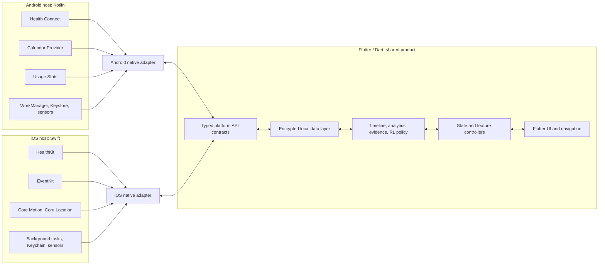
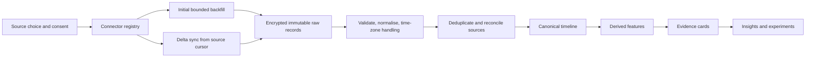
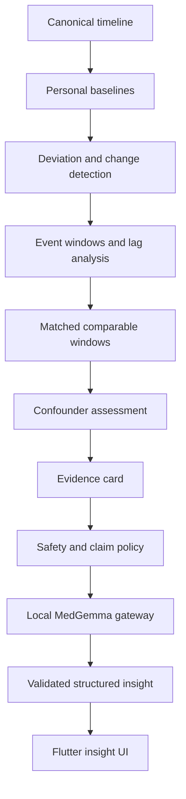
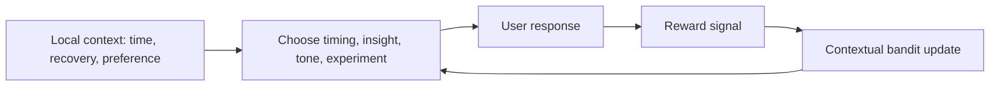

# Private Health OS — Flutter-First Cross-Platform Plan

**Document status:** Hackathon implementation plan  
**Platforms:** Android and iOS  
**Primary UI and application language:** Dart / Flutter  
**Native edge languages:** Kotlin for Android; Swift for iOS  
**Privacy posture:** All personal data, analytics, feedback, and inference stay on-device by default.

---

## Executive summary

We will build a **Health OS**, not two separate mobile apps:

- **Flutter owns the product:** every screen, navigation path, state model, timeline, insight card, journal, settings screen, and shared business rule is written once in Dart.
- **Native code owns only the platform edge:** Android Health Connect, iOS HealthKit, calendar providers, background jobs, permission sheets, platform keys, and the low-level local model runtime.
- **A private canonical timeline joins the data:** the app converts sleep, heart rate, meetings, screen use, movement, location, and check-ins into one local event model with full provenance.
- **An evidence engine finds a pattern before MedGemma speaks:** deterministic analytics create an evidence card; MedGemma turns that evidence into a careful human explanation.
- **A contextual bandit provides safe on-device reinforcement learning:** it learns *when* and *how* to present insights, but never retrains LLM weights from a person’s private timeline.

For the one-week hackathon, the full architecture is real on both iOS and Android. The implementation proves it with the highest-value live paths:

1. Health data from Health Connect and HealthKit.
2. Calendar context from Android Calendar Provider and iOS EventKit.
3. Android app-usage context; iOS Screen Time is an entitlement/capability validation track.
4. Two evidence-backed insight types: late screen use -> sleep/recovery and recurring meetings -> pre-event physiological deviation.
5. A local MedGemma explanation pathway plus a local feedback learner.

> **Decision:** Use Flutter for UI and shared application logic; use typed native bridges for platform APIs; use FFI only for C/C++-shaped code such as a quantized local-model runtime.

---

## 1. Product definition

### 1.1 What is the Health OS?

A **Health OS** is a private personal-intelligence layer above data-producing apps and wearables. It does not compete with Ultrahuman, Apple Health, or Health Connect as a store of isolated measurements. It connects those measurements with the surrounding life context and helps the person understand patterns.

The central question is:

> **What changed in my body, what in my life may be connected to it, how certain is that pattern, and what is a safe small experiment to try?**

Example:

> “Across six comparable late nights, social-media use after 11:30 pm was associated with 48 fewer minutes of sleep and lower next-day recovery. This is a repeated association, not proof that the app caused the result. Try a 10:45 pm wind-down for three nights and compare.”

### 1.2 Product boundaries

The app is initially a wellness and self-understanding product.

- It does **not** diagnose a condition.
- It does **not** prescribe treatments or medication changes.
- It does **not** label a manager, friend, meeting, or app as the cause of stress.
- It does show the supporting data, alternatives, and uncertainty for every meaningful insight.

### 1.3 Primary product surfaces

| Flutter feature | Purpose |
|---|---|
| Home / Today | One or two useful, non-alarming observations with confidence and next action |
| Timeline | A merged view of health, schedule, activity, device behaviour, and check-ins |
| Insight detail | Observation, evidence, caveats, alternatives, and a reversible experiment |
| Evidence drawer | Exact time windows, baseline, repeat count, data sources, and data gaps |
| Health journal | Fast manual logs: mood, caffeine, illness, medication, alcohol, meals, life event |
| Sources centre | Per-source consent, supported fields, sync status, history window, revoke/delete |
| Experiments | Track a user-selected habit experiment against a personal outcome |
| Privacy centre | Export, delete, data locality, model version, and source provenance |

---

## 2. Flutter-first architecture



### 2.1 What runs where?

| Layer | Language / runtime | Why it lives there |
|---|---|---|
| UI, navigation, state, product features | Flutter / Dart | One codebase and one product experience across iOS and Android |
| Canonical timeline, feature calculations, evidence logic, bandit policy | Dart | Shared deterministic behaviour and shared tests |
| App database schema, queries, repositories | Dart + platform database binding | One data model while retaining native encrypted storage support |
| Health, calendar, permissions, background, secure-key APIs | Kotlin or Swift through a Flutter plugin | These are operating-system APIs, not portable Dart APIs |
| Quantized model execution | C/C++ runtime through FFI, or native Kotlin/Swift runtime through a bridge | Local LLM runtimes are platform/hardware specific |

### 2.2 Flutter-native boundary rule

Use this decision rule for every capability:

1. **Flutter package with audited support exists:** use it behind our own adapter interface.
2. **The API is platform-specific but structured/high-level:** write a Kotlin/Swift plugin with **Pigeon** generated types.
3. **The API is a C/C++ inference or compute library:** use **Dart FFI**.
4. **The capability is impossible or prohibited on a platform:** return an explicit `unsupported` state; never fake parity.

The first two rules prevent Dart UI code from depending directly on Android or iOS details. The third prevents expensive serialization of high-throughput model data.

### 2.3 Recommended repository structure

```text
health_os/
  lib/
    app/                         # app shell, routing, theme, dependency wiring
    core/                        # errors, time, ids, privacy labels, utilities
    domain/                      # entities and pure business rules
    data/                        # database, repositories, source cache
    features/
      home/
      timeline/
      insights/
      journal/
      experiments/
      sources/
      privacy/
    platform_api/                # Dart interfaces and generated Pigeon APIs
  pigeon/                        # typed cross-platform API definitions
  test/                          # unit and integration tests for pure Dart logic
  integration_test/              # device-level tests
  android/app/src/main/kotlin/   # Android plugin implementations
  ios/Runner/                    # Swift plugin implementations and entitlements
  native/inference_runtime/      # optional C/C++ FFI package for local models
  docs/                          # plan, schemas, demo script, decisions
```

---

## 3. Definitions and glossary

| Term | Plain-English definition | Why it matters here |
|---|---|---|
| **Adapter / connector** | A small component that knows how to read one data source and convert it into our shared format. | HealthKit, Health Connect, EventKit, and Usage Stats each need a different adapter. |
| **Platform channel** | A message bridge between Dart and native Kotlin/Swift code. | Used for high-level OS APIs such as health permissions and calendar reads. |
| **Pigeon** | A Flutter tool that generates type-safe Dart, Kotlin, and Swift channel code from one API definition. | Prevents fragile `Map<String, dynamic>` contracts between Flutter and native code. |
| **FFI (Foreign Function Interface)** | A direct call from Dart into compiled C/C++ code. | Suitable for a local LLM runtime or other performance-critical native library. |
| **Canonical event** | One shared representation of an event regardless of where it came from. | A HealthKit sleep session and a Health Connect sleep session can be analysed by the same code. |
| **Ingestion** | Pulling external data into the app and storing it safely. | Includes permission, backfill, sync, validation, deduplication, and deletion handling. |
| **Backfill** | The first bounded import of historical data. | Lets the app establish personal baselines without requesting unlimited history by default. |
| **Delta sync** | Importing only records changed since the previous successful sync. | Reduces battery, latency, and duplicate records. |
| **Cursor / anchor / token** | A checkpoint supplied by a source that marks where the next delta sync should resume. | Health Connect uses change tokens; HealthKit can use anchors. |
| **Provenance** | Metadata describing where a value came from and when it was changed. | Required to explain and debug an insight; prevents silent source confusion. |
| **Feature** | A derived numeric or categorical signal such as “screen time in the two hours before bed.” | Features turn raw events into inputs for pattern detection. |
| **Personal baseline** | A user’s typical value under comparable conditions. | “High for you” is more meaningful than a population average. |
| **Matched control window** | A similar period used for comparison, such as the same weekday/hour without a meeting. | Reduces misleading correlations caused by time of day or activity. |
| **Evidence card** | A structured, machine-readable explanation of why a pattern passed the analytical threshold. | Grounds MedGemma and enables a user-visible evidence view. |
| **Inference** | Running a model to produce an output. | Here: turn an evidence card into a cautious explanation locally. |
| **Quantization** | Compressing a model’s numeric weights to use less memory and power. | Makes a 4B model more plausible on high-end phones. |
| **Contextual bandit** | A lightweight form of reinforcement learning that learns which action works best in a situation. | Learns insight timing/tone/action without retraining the LLM. |
| **Idempotent operation** | An operation that produces the same final result even if it runs more than once. | Essential for sync retries and crash recovery. |

---

## 4. Data sources and collection strategy

### 4.1 Unified source matrix

| Domain | Android source | iOS source | Example canonical events | Hackathon priority |
|---|---|---|---|---:|
| Health and wearables | Health Connect | HealthKit | sleep session, HR sample, HRV, workout, steps, SpO2, skin temperature | P0 |
| Ring data | Health Connect export or official vendor connector | HealthKit export or official vendor connector | vendor recovery score, sleep summary, activity summary | P0 if exported |
| Calendar | Calendar Provider | EventKit | meeting, travel, social event, recurring block | P0 |
| Screen / app use | UsageStatsManager | Screen Time validation track | app-category session, last-device-use time | P0 Android / P1 iOS |
| Motion and place | Activity Recognition and location | Core Motion and Core Location | walking, driving, commute, outdoor interval | P1 |
| Environment | sensors and on-device sound-level derivation | sensors and on-device sound-level derivation | noise bucket, light exposure proxy | P2 |
| Journal | Flutter form | Flutter form | caffeine, mood, illness, medication, alcohol, meal time | P0 |
| Medical records | Health Connect FHIR when available | HealthKit records when available | lab result, allergy, medication record | P2 |

### 4.2 Privacy-safe context policy

Allowed by default after explicit source consent:

- time, duration, recurrence, category, data origin, and approximate count/bucket;
- health measurements the person selected;
- coarse app category and duration rather than app content;
- user-entered journal facts.

Never ingest in v1:

- message bodies, email text, notification content, call audio, phone-call history, browser history, screen images, or social-feed content;
- raw calendar descriptions, attendee names, or locations unless a future specific feature requires it and the person opts in.

### 4.3 Ring integration rule

Ultrahuman is treated as a source, not as the centre of the architecture. Start with the platform health store. Add a direct Ultrahuman adapter only if a user-approved official interface provides a critical signal unavailable through Health Connect or HealthKit. Never reverse engineer ring Bluetooth traffic for the hackathon.

---

## 5. Unified ingestion and storage pipeline



### 5.1 Connector lifecycle

Each Flutter-facing source adapter exposes the same lifecycle:

```text
requestAccess(selectedDataTypes)
getAvailability()
initialBackfill(timeWindow)
readDelta(cursor)
normalise(nativeRecord)
revokeAccessAndPurge(scope)
```

**Implementation pattern:**

- Dart feature code calls a Pigeon-generated `HealthSourceApi` / `CalendarSourceApi`.
- The Android Kotlin implementation calls Health Connect, Calendar Provider, or Usage Stats.
- The iOS Swift implementation calls HealthKit, EventKit, or Core Motion.
- Both return the same typed DTOs to Dart.
- Dart validates and saves data inside a transaction.

### 5.2 Canonical data contract

```json
{
  "id": "evt_01J...",
  "type": "calendar.meeting",
  "startAt": "2026-07-10T10:00:00+05:30",
  "endAt": "2026-07-10T10:30:00+05:30",
  "value": {
    "category": "recurring_one_to_one",
    "attendeeCountBucket": "2"
  },
  "origin": {
    "platform": "ios",
    "provider": "EventKit",
    "externalId": "source-private-id"
  },
  "sourceModifiedAt": "2026-07-09T09:00:00+05:30",
  "privacyLevel": "sensitive",
  "schemaVersion": 1
}
```

### 5.3 Local tables

| Table | Data | Rule |
|---|---|---|
| `raw_records` | Original source payload and source metadata | Immutable; encrypted; do not silently overwrite |
| `canonical_events` | Normalized shared timeline events | Stable IDs and provenance preserved |
| `sync_cursors` | Change token/HealthKit anchor/checkpoint | Update only after a complete successful transaction |
| `derived_features` | Baselines, exposures, daily aggregates | Version by algorithm version |
| `evidence_cards` | Effect, repeats, controls, alternatives, confidence | Keep source-event references and computation version |
| `insights` | Rendered model output and safety result | Always reference an evidence-card version |
| `feedback_events` | Helpful, dismiss, snooze, action feedback | Local only; opt-out capable |

### 5.4 Storage and encryption

Recommended Flutter data layer:

- **Drift + SQLite** for typed, reactive local queries.
- **SQLCipher-compatible encrypted SQLite build** for database-at-rest protection.
- **flutter_secure_storage** only for wrapping/holding the database key, not for time-series data.
- Android key material from **Android Keystore**; iOS key material from **Keychain**.

Data should never be stored in ordinary preferences, plaintext JSON exports, app logs, analytics SDKs, or crash reports.

### 5.5 Sync correctness rules

1. Use source-origin IDs to deduplicate. If no source ID exists, use a stable hash of origin, type, start/end, and value.
2. Do not add two providers’ step counts together. Let the person choose a primary source per metric; retain alternatives for inspection.
3. Preserve source time zone and device metadata. Convert only for display/analysis.
4. Treat vendor “stress” and “recovery” as vendor-derived scores, not clinical measurements.
5. A source deletion or permission revocation cascades: raw record -> canonical event -> feature invalidation -> evidence/insight invalidation.
6. Every ingestion write is idempotent, so retrying after an interruption cannot create duplicate health events.

---

## 6. Analytics, evidence, and MedGemma inference



### 6.1 The analysis engine: what it does

The non-LLM analysis engine is the core intelligence. It must calculate, not guess:

- personal hour-of-day and weekday baselines for resting HR, HRV, sleep duration, and recovery;
- deviations from those baselines;
- event windows: for example, 15/30/60 minutes before and after a recurring meeting;
- lagged patterns: late screen use -> sleep -> next-day recovery;
- matched controls: comparable hours/days without the event;
- confounders: workout, walking, caffeine, illness, travel, missing-data periods;
- confidence from repeat count, effect size, data quality, and conflicting evidence.

### 6.2 Evidence card contract

```json
{
  "claimType": "repeated_association",
  "claim": "Late social-media use is associated with shorter sleep",
  "occurrences": 6,
  "comparisonWindows": 14,
  "effect": {"metric": "sleep_duration_minutes", "delta": -48},
  "confidence": "moderate",
  "alternatives": ["late workout", "caffeine after 17:00"],
  "permittedLanguage": ["associated with", "may contribute"],
  "prohibitedLanguage": ["caused", "diagnosis", "treatment"]
}
```

### 6.3 MedGemma gateway

`LocalModelGateway` is a Dart interface:

```text
generateInsight(evidenceCard, tone, guidanceContext) -> InsightDraft
healthCheck() -> ModelRuntimeStatus
```

Its rules:

- It receives the evidence card, selected tone, and curated local guidance—not a raw dump of the timeline.
- It produces strict JSON: `observation`, `evidenceSummary`, `uncertainty`, `suggestedExperiment`, and `seekCareMessage` only when a deterministic safety flag permits it.
- Dart validates the JSON and claim wording before displaying it.
- It may not diagnose, prescribe, use causal language that the evidence card forbids, or invent values.

### 6.4 Local-model runtime path

| Need | Choice |
|---|---|
| Flutter app calls a high-level model method | Dart repository / `LocalModelGateway` |
| Health/permissions/model-host integration | Kotlin/Swift plugin via Pigeon |
| Quantized C/C++ model backend | Dart FFI package |
| Primary model experiment | Quantized MedGemma 4B instruction-tuned model on capable devices |
| Device fallback | Smaller local explanation model using the same evidence-card interface |
| Hackathon contingency | Clearly labelled local development-machine inference; no claim that it is phone-local |

Run a real device performance spike on Day 1. Measure memory, first-token latency, total generation time, thermals, battery, model-download size, and behaviour in background/foreground transitions before promising phone-local MedGemma to judges.

---

## 7. On-device reinforcement learning

Use reinforcement learning to optimise the **insight policy**, not to mutate a medical language model on every phone.



### 7.1 Contextual bandit design

| Component | Design |
|---|---|
| Context | Current time, local quiet hours, insight confidence, recent recovery, source availability, past stated preference |
| Actions | Show now, evening reflection, weekly review, suppress; concise/detailed; reflection/experiment |
| Reward | Helpful, acted on suggestion, snoozed, dismissed; explicitly not “time in app” |
| Algorithm | Thompson Sampling first; LinUCB if feature space grows |
| Storage | `feedback_events` and policy parameters in encrypted local storage |
| User controls | Disable learning, reset learned preferences, inspect why an insight was shown |

### 7.2 Later LLM improvement

After the hackathon, improve MedGemma offline using this sequence:

1. **Supervised fine-tuning (SFT):** examples of excellent evidence-grounded insights.
2. **Preference training:** clinician/reviewer chooses a grounded, safe response over an overconfident response.
3. **GRPO:** reward generated outputs for schema validity, factual support, causal calibration, safety, clarity, and helpfulness.
4. Quantize and deploy a frozen model. Do not continuously train it on private phone timelines.

---

## 8. Privacy, safety, and compliance posture

### 8.1 Privacy guarantees for v1

- No personal health data, calendar context, feedback, prompts, or insights are sent to an app backend.
- No third-party product analytics or session replay SDK can see the data.
- Model downloads may use the network but contain no user health data.
- Users can toggle sources individually, choose import history depth, see provenance, export local data, delete local data, and revoke a source.

### 8.2 Safety policy

- Use “associated with,” “appears before,” and “may contribute” unless an evidence card supports an intervention-level conclusion.
- Never issue an LLM-generated urgent alert. Any future emergency path must come from clinically reviewed deterministic criteria.
- Never write a statement about a third party’s intent or a user’s mental-health diagnosis from wearables or calendar context.
- Avoid anxiety-producing push notifications about physiological changes. Prefer a deliberate reflection or weekly review.

### 8.3 Important reality check

On-device processing sharply reduces data exposure; it does **not** remove the need for consent, secure engineering, platform permission compliance, honest wellness positioning, or a medical-product review before clinical claims.

---

## 9. Seven-day implementation plan

### 9.1 Definition of hackathon success

By the demo, both Android and iOS apps must visibly share the same Flutter product UI and canonical data model. Each must ingest at least one live health source and one live context source. The app must create an evidence card, generate a safe explanation, and show local feedback adaptation.

| Day | Shared Flutter delivery | Android native delivery | iOS native delivery |
|---|---|---|---|
| 1 | Flutter repo, app shell, routing, theme, seed timeline, Pigeon contracts | Plugin skeleton and model-runtime spike | Plugin skeleton, entitlements, model-runtime spike |
| 2 | Drift schema, repositories, sources centre, consent UX | Health Connect adapter | HealthKit adapter |
| 3 | Timeline UI and canonical events | Calendar Provider + Usage Stats adapter | EventKit + Core Motion adapter |
| 4 | Baselines, matched controls, evidence-card UI | Change-token/checkpoint logic | Anchor/checkpoint logic |
| 5 | `LocalModelGateway`, structured response validation | Device inference path | Device inference path |
| 6 | Contextual bandit, journal, privacy centre, export/delete stub | Real-device QA | Real-device QA |
| 7 | Demo scenario, offline seed fallback, pitch, recording, final tests | Build/rehearse | Build/rehearse |

### 9.2 Team split

| Owner | Primary responsibilities |
|---|---|
| Builder A | Flutter UI shell, data layer, timeline/insight/evidence screens, Android adapter integration |
| Builder B | Flutter domain algorithms, iOS adapter integration, model gateway, bandit policy |
| Codex | Scaffold, Pigeon contracts, schemas, seed timeline, analytics/evidence tests, prompts, documentation, debugging, UI copy, demo narrative |

### 9.3 Non-negotiable gates

1. **End of Day 1:** Android and iOS display the same seeded Flutter timeline.
2. **End of Day 2:** Android Health Connect and iOS HealthKit each write into the shared Dart data repository.
3. **End of Day 3:** Calendar events appear as canonical events on both platforms; Android usage data is additive.
4. **End of Day 4:** Two evidence cards are produced with no LLM involved.
5. **End of Day 5:** A valid evidence card becomes a schema-validated insight through the model gateway.
6. **End of Day 6:** Helpful/dismiss feedback changes future delivery locally.

### 9.4 Risks and pre-decided responses

| Risk | Response |
|---|---|
| Ultrahuman data does not reach the health store | Use explicitly labelled seeded ring-compatible data; preserve generic health-store integration |
| iOS Screen Time route is unavailable | Expose the source as unsupported; demo HealthKit + EventKit + Core Motion, not fake app-usage data |
| MedGemma does not run acceptably on a test phone | Keep model gateway; use a clearly labelled local development fallback and demo the phone-local evidence engine |
| Health permissions take too long | Seed demo data remains first-class, not a last-minute mock |
| Data is incomplete or contradictory | Lower confidence and display “not enough comparable data”; do not force an insight |

---

## 10. Demo story

1. Launch the same Flutter Health OS on an Android phone and iPhone.
2. Open Sources and show health/calendar permission states.
3. Display a merged private timeline with source provenance labels.
4. Show an insight: late screen use is associated with shorter sleep, or recurring meeting windows are associated with elevated pre-event HR.
5. Open the evidence drawer: repeat count, matched comparison windows, effect, alternatives, and confidence.
6. Mark it Helpful or dismiss it.
7. Show a later recommendation with timing/tone adjusted by the on-device bandit.
8. End with the privacy promise: **“Your life data is used to help you, not to build a profile of you elsewhere.”**

---

## 11. Technical references

- Flutter’s official overview of platform-specific integration and custom plugins: <https://docs.flutter.dev/platform-integration>
- Flutter platform channels and Kotlin/Swift host support: <https://docs.flutter.dev/platform-integration/platform-channels>
- Flutter FFI and the recommended `package_ffi` template: <https://docs.flutter.dev/platform-integration/bind-native-code>
- Android Health Connect differential sync: <https://developer.android.com/health-and-fitness/health-connect/sync-data>
- Apple HealthKit anchored incremental queries: <https://developer.apple.com/documentation/healthkit/hkanchoredobjectquery>
- Apple HealthKit background delivery: <https://developer.apple.com/documentation/healthkit/executing-observer-queries>

---

## 12. Final implementation choice

**Use Flutter as the primary application platform.**

Write the Health OS UI and all product/domain logic once in Dart. Use Kotlin and Swift only where the operating systems require native access. Use Pigeon-generated platform channels for Health Connect, HealthKit, calendars, permissions, background behaviour, and secure keys. Use FFI only for a C/C++ local inference runtime or another genuinely performance-sensitive native module.

The first code artefact should be the typed `EvidenceCard` and `CanonicalEvent` contract. Once those are stable, every new wearable or app becomes an adapter addition—not a rewrite of the Health OS.
