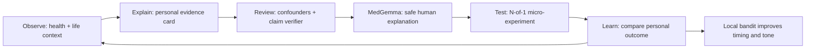
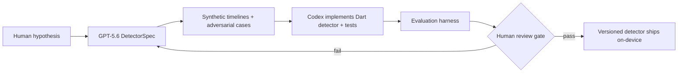
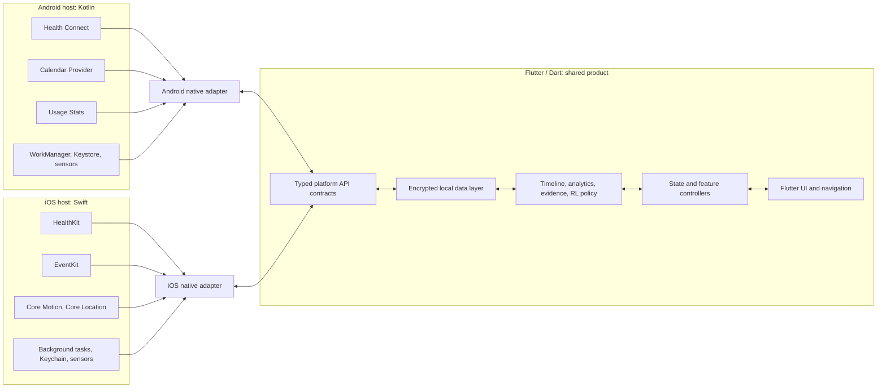
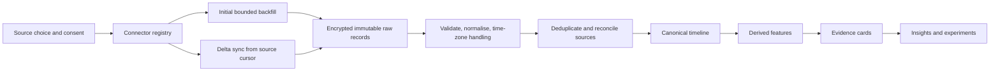
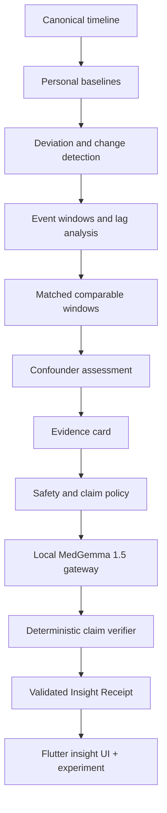
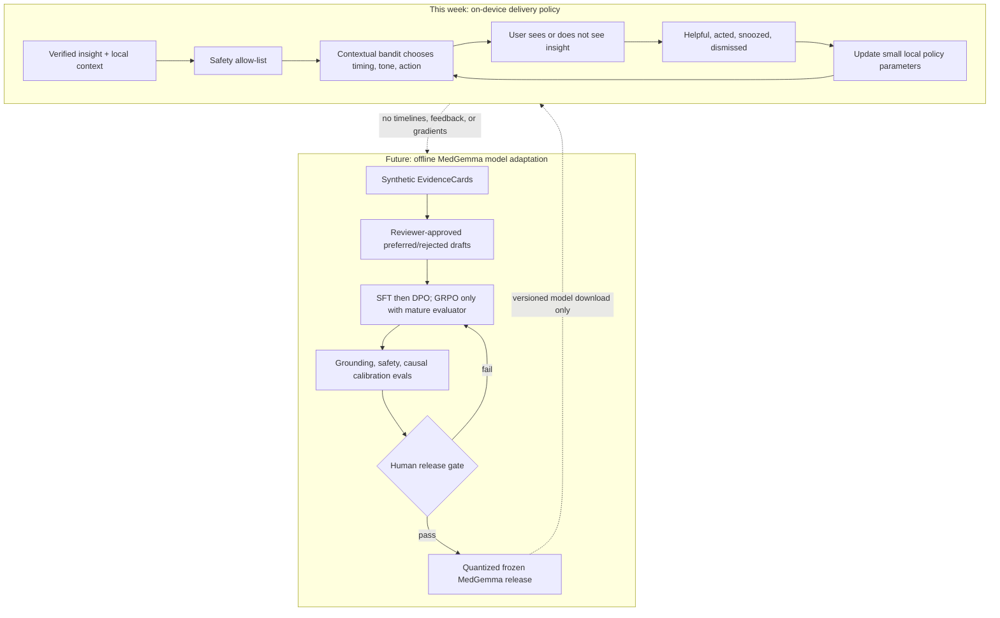
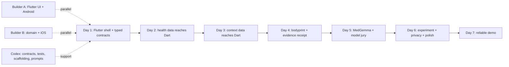

# WhyPulse — Private Health OS Build Week Plan

**Document status:** OpenAI Build Week implementation and submission plan

**Category:** Apps for Your Life

**Submission deadline:** July 21, 2026 at 5:00 PM Pacific Time

**Platforms:** Android and iOS

**Primary UI and application language:** Dart / Flutter

**Native edge languages:** Kotlin for Android; Swift for iOS

**Build/evaluation language:** Python 3.12 for the synthetic-only GPT-5.6 lab and future model-training scripts

**Storage/query language:** SQL through Drift + encrypted SQLite/SQLCipher

**Optional inference language:** C/C++ behind Dart FFI only if required by the chosen MedGemma runtime

**Privacy posture:** The personal timeline, analytics, feedback, and MedGemma inference path stay on-device. GPT-5.6 is a build-time engineering and evaluation tool only: it receives fictional hypotheses, synthetic fixtures, schemas, code, and test results—never PII, real health values, calendar records, contacts, or any derived personal evidence. The release app contains no OpenAI API key, SDK, endpoint, or GPT network path.
**Working pitch line:** *Your health changed. Let’s find out why—privately, with evidence.*

---

## Executive summary

We will build a **Health OS**, not two separate mobile apps:

- **Flutter owns the product:** every screen, navigation path, state model, timeline, insight card, journal, settings screen, and shared business rule is written once in Dart.
- **Native code owns only the platform edge:** Android Health Connect, iOS HealthKit, calendar providers, background jobs, permission sheets, platform keys, and the low-level local model runtime.
- **A private canonical timeline joins the data:** the app converts sleep, heart rate, meetings, screen use, movement, location, and check-ins into one local event model with full provenance.
- **An evidence engine finds a pattern before MedGemma speaks:** deterministic analytics create an evidence card; MedGemma 1.5 4B turns that bounded evidence into a careful human explanation.
- **A model jury challenges every insight:** a deterministic claim verifier checks numbers and causal language on-device; GPT-5.6 strengthens that verifier before release using only synthetic EvidenceCards and adversarial fixtures.
- **An Insight Compiler turns hypotheses into tested detectors:** GPT-5.6 produces a structured detector specification, Codex implements and tests the Dart detector, and only reviewed code ships to the phone.
- **A contextual bandit provides safe on-device reinforcement learning:** it learns *when* and *how* to present insights, but never retrains LLM weights from a person’s private timeline.
- **A personal experiment loop turns correlation into learning:** the user can test an insight with a small N-of-1 experiment, compare the outcome, and improve their own baseline.

For the one-week hackathon, the full architecture is real on both iOS and Android. The implementation proves it with the highest-value live paths:

1. Health data from Health Connect and HealthKit.
2. Calendar context from Android Calendar Provider and iOS EventKit.
3. Android app-usage context; iOS Screen Time is an entitlement/capability validation track.
4. Two evidence-backed insight types: late screen use -> sleep/recovery and recurring meetings -> pre-event physiological deviation.
5. A local MedGemma explanation pathway plus a local feedback learner.
6. A visible Evidence Receipt, Confounder Radar, personal experiment, and Timeline Replay.
7. A reproducible GPT-5.6 + Codex evaluation trail with synthetic fixtures, red-team cases, and a submission-ready decision log.
8. A compile-time privacy boundary proving that the shipped mobile targets cannot call GPT-5.6 or construct an outbound personal-data payload.

> **Decision:** Use Flutter for UI and shared application logic; use typed native bridges for platform APIs; use FFI only for C/C++-shaped code such as a quantized local-model runtime.

---

## 0. Winning strategy

### 0.1 The one-sentence pitch

> **WhyPulse connects all the health data a person chooses to make available with the moments around it, shows the evidence and alternative explanations, and helps them run a private experiment to learn what improves their health.**

This pitch has four judge-friendly ideas in one sentence:

1. A clear user problem: health apps report *what*, not *why*.
2. A technical differentiator: multimodal longitudinal context, not one chart or one prompt.
3. A trust mechanism: every claim is traceable to evidence.
4. A closed learning loop: observe -> explain -> test -> learn.

### 0.2 The novelty loop



The product’s novelty is the **combination** of these layers, not any one API:

| Novel layer | What conventional apps commonly do | What WhyPulse demonstrates |
|---|---|---|
| Cross-domain personal timeline | Keep sleep, exercise, meetings, and phone behaviour in separate apps | Join body and life context locally with provenance |
| Evidence-before-generation | Show a score or let a chatbot speculate | Compute matched comparisons and confounders before the LLM writes |
| Auditable language model | Give a polished answer with no inspectable support | Every displayed number and claim opens its evidence card |
| N-of-1 experiment loop | Give generic advice | Let the user test a reversible change against their own baseline |
| Private adaptive policy | Optimise cloud engagement | Learn timing/tone locally from helpfulness and action feedback |
| Cross-platform native data edge | Build a platform-specific prototype | Use one Flutter product with honest Kotlin/Swift source adapters |
| Model jury | Trust one fluent model response | Evidence engine establishes facts, MedGemma explains, deterministic code verifies, GPT-5.6 red-teams |
| Insight Compiler | Hand-code one-off rules with no lineage | Convert a hypothesis into a versioned detector spec, fixtures, tests, and review record |
| Temporal health signatures | Show isolated daily scores | Learn a personal “bodyprint” around recurring event classes across minutes, days, and weeks |

### 0.3 Why this is a MedGemma project

MedGemma is not added as a decorative chat box. It has a constrained, medically relevant job:

- translate a structured physiological/contextual evidence card into understandable language;
- preserve uncertainty and separate association from causation;
- propose one low-risk, reversible behavioural experiment;
- explain health terminology and the significance of changes without diagnosing;
- refuse unsupported claims through a validated output contract.

The deterministic engine provides truth constraints; MedGemma provides medically aware interpretation and communication. This is stronger than asking a generic LLM to inspect a JSON dump and “find insights.”

### 0.4 Build Week judge-score strategy

| Official judging dimension | What the judges must see | Proof in the demo |
|---|---|---|
| Technological Implementation | Codex use is thorough and the implementation is non-trivial | Native adapters, canonical timeline, pure-Dart detector tests, MedGemma gateway, evaluation artefacts, Codex decision log |
| Design | The project is runnable and feels complete rather than like a model demo | One coherent Home -> Replay -> Evidence Receipt -> Test This journey on both platforms |
| Potential Impact | A real person can understand and act on a concrete problem | Meeting/HR and doomscrolling/sleep stories become low-risk personal experiments |
| Quality of the Idea | The team understands longitudinal health, uncertainty, and privacy | Confounder Radar, claim ladder, negative findings, local-first architecture, honest safety boundaries |

### 0.5 Scope tiers for a winning week

The full architecture remains broad, but the demo must protect its judge-visible critical path.

**SHIP — must work in the live demo**

- Same polished Flutter app on Android and iOS.
- One live health adapter on each platform: Health Connect and HealthKit.
- Calendar context on both platforms.
- One excellent insight with evidence; second insight available through seed data.
- “Test this” creates a three-day N-of-1 experiment.
- MedGemma produces a schema-validated explanation, with an honest runtime label.
- Evidence Receipt shows exact measurements, repeats, matched windows, exclusions, confounders, data gaps, detector version, and provenance.
- Timeline Replay animates the 30 minutes around a recurring event and overlays the personal matched baseline.
- Model Jury rejects unsupported numbers and causal language before an insight reaches the UI.
- GPT-5.6/Codex Insight Compiler artefacts exist for both demo detectors.
- Source provenance, local-data statement, and resilient seed/live switch.

**STRETCH — build only after every SHIP gate is stable**

- Android Usage Stats doomscrolling signal.
- Journal entry for caffeine/mood/illness.
- Contextual-bandit feedback adaptation.
- Full privacy centre and local-data deletion.
- Confounder Radar editing: the user can add “coffee,” “workout,” or “illness” and immediately recompute confidence.
- Just-in-time pre-event micro-coach using a local notification and a user-approved experiment.
- A What-if Lab showing a bounded estimate plus uncertainty, never a causal promise.

**DESIGN — architecture and contracts only during the hackathon**

- iOS Screen Time entitlement path, FHIR records, direct ring SDK, nutrition vision, environmental sensors, federated detector packs, clinician export, generalized causal discovery, and a full personal digital twin.

### 0.6 Five designed “wow” moments

1. **The insight:** “Your heart rate rises before this recurring meeting” appears as a human observation, not a graph.
2. **The receipts:** tapping “Why?” reveals repeat count, matched no-meeting windows, excluded active periods, confidence, and alternative explanations.
3. **The scientific loop:** tapping “Test this” creates a personal experiment; the app will compare future meetings with and without a five-minute buffer.
4. **The replay:** the judge scrubs through the minutes before the recurring meeting and watches heart rate diverge from the matched baseline while activity confounders disappear.
5. **The jury:** the app reveals that one possible explanation was downgraded because caffeine data was missing, then shows the exact low-risk question needed to improve confidence.

If phone-local inference is verified, add a fourth moment: switch to airplane mode before generation and show that the insight still works. Do not perform this claim if inference uses the development-machine fallback.

### 0.7 Novel feature portfolio and implementation map

The architecture includes the full product vision, but the one-week build uses three truth labels:

- **SHIP:** implemented, tested, and shown in the primary demo.
- **STRETCH:** implemented only after all SHIP gates pass; may use deterministic seed data if labelled.
- **DESIGN:** specified with contracts and extension points, but never presented as working.

This distinction is itself part of the trust story. A smaller honest product scores better than a video that implies unfinished features exist.

#### A. Evidence and reasoning features

| Feature | What makes it novel | Implementation | Tier |
|---|---|---|---|
| **Body–Life Context Graph** | Treats a person’s body signals and life events as one temporal graph rather than separate dashboards | Store `CanonicalEvent` nodes and typed edges such as `precedes`, `overlaps`, `same_recurring_class`, and `possible_confounder`; materialize only the edges required by active detectors | SHIP |
| **Evidence Receipt** | Every human sentence has inspectable support | Render `EvidenceCard` fields: detector/version, effect, matched controls, repeat count, exclusions, data completeness, confidence, alternatives, permitted language, and source-event IDs | SHIP |
| **Confounder Radar** | Shows what else could explain a pattern instead of hiding uncertainty | Run rule-based checks for activity, caffeine, illness, travel, late meals, missing HR, and schedule shifts; label each `observed`, `absent`, `unknown`, or `conflicting` | SHIP |
| **Temporal Bodyprint** | Learns a recurring physiological signature around an event category | Resample HR/HRV/activity into five-minute buckets in `[-30m,+30m]`; calculate median and median absolute deviation across occurrences; compare with matched control windows | SHIP |
| **Multi-timescale reasoning** | Links minute-scale stress, night-scale sleep, and week-scale recovery | Maintain detector windows at `minute`, `night`, and `week` levels; join only through explicit lag edges, never by passing an entire timeline to an LLM | STRETCH |
| **Negative findings** | Tells users when an intuitive story is not supported | Persist `RejectedCandidate` with the failed threshold and render calm copy such as “No repeatable link yet”; never turn absence of evidence into reassurance about disease | STRETCH |
| **Insight lifecycle** | Insights can strengthen, weaken, expire, or be disproven | State machine: `candidate -> supported -> testing -> strengthened/weakened/inconclusive -> stale`; invalidate when underlying source records change | STRETCH |
| **Cross-metric coherence check** | Prevents a single noisy metric from dominating | Raise confidence only when aligned supporting signals exist, such as HR rise plus HRV decline; lower it when metrics disagree | DESIGN |

#### B. Action and personal-science features

| Feature | What makes it novel | Implementation | Tier |
|---|---|---|---|
| **N-of-1 Experiment Builder** | Moves from passive correlation to a test against the user’s own baseline | Persist hypothesis, intervention, outcome, eligibility rules, baseline, schedule, adherence, and analysis plan; use a fixed A/B or baseline/intervention comparison | SHIP |
| **Timeline Replay** | Makes longitudinal evidence emotionally understandable in seconds | Flutter scrubber selects relative time; chart overlays the occurrence median, matched baseline, and excluded windows; replay uses cached five-minute buckets | SHIP |
| **Just-in-time Micro-coach** | Acts at the moment a known pattern is about to recur | Schedule a local notification only for an active user-approved experiment; message contains the chosen action, never an alarming physiological claim | STRETCH |
| **What-if Lab** | Lets users explore a bounded estimate instead of receiving generic advice | Recompute the observed effect after filtering a context, e.g. nights without late screen use; display point estimate, range, sample count, and “observational estimate” label | STRETCH |
| **Habit Stack Detector** | Finds combinations such as late meal + screen use rather than blaming one event | Mine only predeclared two-factor combinations; require minimum support and compare against each factor alone to avoid combinatorial false positives | DESIGN |
| **Recovery Budget** | Translates accumulated load into understandable capacity without inventing a medical score | Aggregate normalized deviations from sleep, HRV, activity, and schedule load; show contributing components and avoid labels such as “safe” or “unsafe” | DESIGN |
| **Social Recovery Lens** | Looks for restorative social patterns without analysing messages or people | Use user-labelled `social_plan` intervals and post-event recovery/mood only; names, messages, and contact identities never enter the model | DESIGN |

#### C. Intelligence, model, and learning features

| Feature | What makes it novel | Implementation | Tier |
|---|---|---|---|
| **MedGemma Health Narrator** | Uses a medical model only after evidence exists | Run MedGemma 1.5 4B IT behind `LocalModelGateway`; input is a bounded EvidenceCard and curated guidance; output must match `InsightDraft` JSON | SHIP |
| **Model Jury** | Separates analyst, narrator, critic, and verifier roles | Deterministic engine establishes facts; MedGemma drafts; `ClaimVerifier` traces every number and phrase to the card; GPT-5.6 red-teams only synthetic cases before release | SHIP |
| **Insight Compiler** | Makes new health detectors auditable products of GPT-5.6 + Codex, not prompt magic | GPT-5.6 writes a `DetectorSpec`; Codex creates pure-Dart implementation, fixtures, and tests; human approval records detector hash/version before shipping | SHIP as build artefact |
| **Ask My Evidence** | Natural-language questions compile to safe local queries | MedGemma maps a question to a restricted `EvidenceQuery` schema; Dart executes only allow-listed aggregates and returns provenance with the answer | STRETCH |
| **Quiet Intelligence** | Optimizes helpfulness and timing instead of engagement | Thompson Sampling chooses `show_now`, `reflection`, `weekly`, or `suppress`; explicit helpful/action/snooze/dismiss rewards update local parameters | STRETCH |
| **Personal language calibration** | Learns concise versus detailed explanations without training on private medical content | Store presentation preference separately from health data; use fixed tone templates and bandit actions, not model-weight updates | STRETCH |
| **Offline preference training** | Improves future MedGemma releases with reviewer judgement | After the event, create fictional synthetic or specifically licensed reviewer-authored preference pairs, train LoRA with SFT/DPO or GRPO, run safety evals, quantize, and ship a frozen version | DESIGN |

#### D. Privacy, safety, and trust features

| Feature | What makes it novel | Implementation | Tier |
|---|---|---|---|
| **Privacy Firewall** | Makes the privacy boundary visible and executable | Classify personal fields as `device_only`; keep the GPT lab outside the mobile dependency graph; show that the release app has no OpenAI key, SDK, endpoint, or payload builder | SHIP |
| **Claim Ladder** | Makes certainty a state machine rather than a vague confidence badge | Levels: `observation`, `repeated association`, `matched association`, `personal experiment signal`; only experiment results can reach the final level | SHIP |
| **Claim Verifier** | Rejects fluent unsupported output | Parse model JSON; assert all numbers exist in EvidenceCard; scan prohibited causal/diagnostic/treatment terms; verify experiment is allow-listed and reversible | SHIP |
| **Consent and Provenance Receipt** | A user can see why each datum exists and what depended on it | Store consent version, source, permission scope, import window, transform version, and dependent evidence IDs; revocation cascades invalidation | SHIP |
| **Privacy Budget** | Prevents gradual expansion of collected context | Each detector declares required fields and retention; Sources UI shows why it is needed; unused raw payload fields are discarded during normalization | STRETCH |
| **Local audit log** | Lets a judge or user inspect every reasoning step without exposing raw content | Append model version, prompt-template hash, detector version, evidence ID, validation result, and latency; never log raw health values or calendar titles | STRETCH |

#### E. Platform and future Health OS features

| Feature | Implementation path | Tier |
|---|---|---|
| **Capability-aware model routing** | Benchmark RAM, NPU/GPU support, thermal state, and model readiness; select full MedGemma, reduced local path, or deterministic template with a visible runtime label | SHIP |
| **Adaptive sensor budget** | Background scheduler increases sync frequency only around an approved experiment and returns to battery-sparing deltas afterward | DESIGN |
| **Federated detector packs** | Share reviewed detector specifications and aggregate validation metrics, never timelines or gradients containing personal events | DESIGN |
| **Clinician-ready export** | Generate a user-initiated PDF/FHIR-style summary containing observations, uncertainty, sources, and experiment results—not diagnoses | DESIGN |
| **Environmental context** | Add weather, light, noise, and air-quality adapters; store coarse buckets and provenance; require explicit consent for location-derived data | DESIGN |
| **Multimodal journal** | Let MedGemma parse an optional lab-report or meal image locally into user-confirmed structured facts; never treat image output as a diagnosis | DESIGN |
| **Personal Digital Twin** | Simulate only validated, narrow personal response models with uncertainty; prohibit broad “future health” predictions | DESIGN |

### 0.8 The signature innovation: the Insight Compiler

The most judge-relevant use of GPT-5.6 and Codex is a reproducible pipeline that converts a human hypothesis into reviewed local intelligence:



`DetectorSpec` is declarative and reviewable:

```json
{
  "id": "pre_event_hr_v1",
  "hypothesis": "A recurring event class is associated with elevated pre-event HR",
  "requiredSignals": ["heart_rate", "calendar_category", "activity"],
  "exposureWindow": {"startMinutes": -15, "endMinutes": 0},
  "controlMatch": ["weekday", "local_time", "activity_bucket"],
  "minimumOccurrences": 4,
  "minimumEffect": {"metric": "median_hr_bpm", "delta": 8},
  "confounders": ["recent_activity", "caffeine_unknown", "illness"],
  "falsifiers": ["effect_disappears_after_activity_matching"],
  "allowedClaimLevel": "matched_association"
}
```

GPT-5.6 does not silently modify the shipped detector. A changed spec produces a new version, new fixtures, a new test run, and a human approval. This gives judges concrete proof of how GPT-5.6 and Codex accelerated non-trivial implementation while personal data remains local.

### 0.9 Zero-personal-data GPT-5.6 lane

GPT-5.6 must be important to the implementation without becoming part of the personal-data runtime. The clean solution is a **separate development toolchain** called `tooling/gpt_lab/`. It produces reviewed engineering artefacts that are compiled into the app, while the app itself has no route back to GPT-5.6.

```mermaid
flowchart LR
    H[Non-personal detector hypothesis] --> G[GPT-5.6 Detector Architect]
    G --> S[Versioned DetectorSpec]
    S --> F[GPT-5.6 synthetic cohort + adversarial fixtures]
    F --> C[Codex implements detector and tests]
    C --> M[MedGemma runs on synthetic EvidenceCards]
    M --> Q[GPT-5.6 rubric evaluator]
    Q --> V[Deterministic verifier + human review]
    V -->|approved| P[Signed detector pack ships to phone]
    V -->|revise| G

    U[Real user timeline] --> D[Packaged detector on device]
    D --> E[Real EvidenceCard on device]
    E --> L[Local MedGemma + Claim Verifier]

    F -. synthetic data only .-> M
    P -. code and static artefacts only .-> D
```



The two lanes share **code contracts**, never user records. GPT-5.6 has five judge-visible jobs:

1. **Detector Architect:** given a generic hypothesis such as “Does late screen exposure correlate with sleep duration?”, produce a `DetectorSpec` describing required signal *types*, windows, controls, confounders, falsifiers, thresholds, and permitted claim level. It sees no measurements or event records.
2. **Synthetic Cohort Generator:** create entirely fictional timelines with generated values, fixture-relative timestamps, a reproducible seed, `synthetic: true`, and a known expected outcome.
3. **Adversarial Red Team:** generate cases for time-zone shifts, duplicate records, missing caffeine logs, exercise before a meeting, contradictory HR/HRV, sparse data, and prompt-injection text in a fictional calendar title.
4. **MedGemma Evaluator:** score MedGemma outputs generated from synthetic EvidenceCards against a fixed rubric for evidence grounding, causal calibration, clarity, safety, and schema compliance. Deterministic checks and human review remain the release gate.
5. **Codex Engineering Partner:** use GPT-5.6 through the primary Codex session to scaffold Dart/Kotlin/Swift code, implement tests, debug failures, explain key decisions, and produce the reproducible evaluation report required for the submission.

#### Hard technical boundary

| Control | Implementation | Proof for judges |
|---|---|---|
| Separate package | Put all GPT calls in `tooling/gpt_lab/`, a development-only CLI that the Flutter app does not import | Mobile dependency graph and release bundle contain no GPT lab code |
| No credential in app | Keep `OPENAI_API_KEY` only in a developer shell or CI secret; never place it in Dart assets, native resources, plist, manifest, or remote config | Secret scan and compiled-bundle scan pass |
| Type barrier | GPT lab accepts only `DetectorHypothesis`, `SyntheticTimeline`, and `SyntheticEvidenceCard`; it cannot import `TimelineRepository`, `RawRecord`, or production `CanonicalEvent` | Architecture test fails on a forbidden import |
| Synthetic marker | Every lab payload requires `synthetic: true`, a generator seed, and a `subjectId` matching `synthetic_*` | Payload validator rejects missing or non-synthetic markers |
| Schema allow-list | Permit detector metadata and synthetic signal values; reject keys such as `name`, `email`, `phone`, `calendarTitle`, `contactId`, `deviceId`, and `sourceRecordId` | Committed forbidden-key test suite |
| No runtime network route | Release app contains no OpenAI SDK, base URL, API client, `GptGateway`, or feature flag that can enable one | `no_openai_dependency_in_mobile_test` plus offline demo |
| Human promotion gate | Generated output can create a pull-request artefact, never silently alter the active detector registry | Manifest records reviewer, detector hash, test run, and approval time |

Minimal contracts:

```json
{
  "detectorHypothesis": {
    "id": "late_screen_sleep",
    "description": "Test whether late screen exposure is associated with sleep duration",
    "targetMetric": "sleep_duration",
    "contextClass": "late_screen_exposure"
  },
  "syntheticTimeline": {
    "synthetic": true,
    "subjectId": "synthetic_0042",
    "seed": 42,
    "events": []
  },
  "evaluationManifest": {
    "model": "gpt-5.6",
    "syntheticOnly": true,
    "promptHash": "sha256:...",
    "detectorVersion": "1.0.0",
    "testRun": "eval_2026_07_18_01",
    "reviewer": "builder_a",
    "approvedAt": "2026-07-18T12:00:00Z"
  }
}
```

Required CI checks:

```text
no_openai_dependency_in_mobile_test
synthetic_marker_required_test
forbidden_key_payload_test
gpt_lab_production_import_test
detector_spec_schema_test
claim_verifier_redteam_test
release_bundle_secret_scan
```

#### GPT lab implementation stack

- Use a small **Python 3.12 CLI** with the official OpenAI SDK and the **Responses API**, selecting `gpt-5.6` explicitly.
- Require JSON Schema/typed parsing for `DetectorSpec`, `SyntheticTimeline`, and `EvaluationReport`; reject free-form output before it becomes an artefact.
- Construct requests only from the lab types. A centralized `assertSyntheticPayload()` runs immediately before the SDK call and logs only the schema version, prompt hash, synthetic seed, model, response ID, and validation result.
- Run generation manually or in an isolated, approval-gated CI job. Ordinary mobile build/test jobs use committed synthetic fixtures and need no API key or network.
- Save the normalized artefact and `EvaluationManifest`, not developer environment variables or any app database. Review the diff, run deterministic tests, then sign the detector manifest.

This is a meaningful GPT-5.6 use—not copywriting—because its structured detector designs, synthetic cohorts, and adversarial evals directly determine what code is tested and eligible to ship. The demo proves it with a DetectorSpec diff, one surprising adversarial fixture, the failing-then-passing test, and the signed evaluation manifest.

### 0.10 Winning-demo feature cut line

The primary demonstration contains exactly this spine:

1. Live or seeded health + calendar data enters the private timeline.
2. A Temporal Bodyprint appears in Timeline Replay.
3. Confounder Radar explains exclusions and unknowns.
4. Evidence Receipt proves the claim.
5. MedGemma converts it into careful language.
6. Claim Verifier visibly passes or rejects the draft.
7. “Test this” creates the personal experiment.
8. A 10-second submission segment shows the GPT-5.6 DetectorSpec, Codex test suite, and `/feedback` session provenance.

Everything else is cut before any of these eight steps becomes unreliable.

---

## 1. Product definition

### 1.1 What is the Health OS?

A **Health OS** is a private personal-intelligence layer above data-producing apps and wearables. It does not compete with Ultrahuman, Apple Health, or Health Connect as a store of isolated measurements. It connects those measurements with the surrounding life context and helps the person understand patterns.

The central question is:

> **What changed in my body, what in my life may be connected to it, how certain is that pattern, and what is a safe small experiment to try?**

Example:

> “Across six comparable late nights, social-media use after 11:30 pm was associated with 48 fewer minutes of sleep and lower next-day recovery. This is a repeated association, not proof that the app caused the result. Try a 10:45 pm wind-down for three nights and compare.”

### 1.2 Product boundaries

The app is initially a wellness and self-understanding product.

- It does **not** diagnose a condition.
- It does **not** prescribe treatments or medication changes.
- It does **not** label a manager, friend, meeting, or app as the cause of stress.
- It does show the supporting data, alternatives, and uncertainty for every meaningful insight.

### 1.3 Primary product surfaces

| Flutter feature | Purpose |
|---|---|
| Home / Today | One or two useful, non-alarming observations with confidence and next action |
| Timeline | A merged view of health, schedule, activity, device behaviour, and check-ins |
| Insight detail | Observation, evidence, caveats, alternatives, and a reversible experiment |
| Evidence drawer | Exact time windows, baseline, repeat count, data sources, and data gaps |
| Health journal | Fast manual logs: mood, caffeine, illness, medication, alcohol, meals, life event |
| Sources centre | Per-source consent, supported fields, sync status, history window, revoke/delete |
| Experiments | Track a user-selected habit experiment against a personal outcome |
| Privacy centre | Export, delete, data locality, model version, and source provenance |

---

## 2. Flutter-first architecture



### 2.1 What runs where?

| Layer | Language / runtime | Why it lives there |
|---|---|---|
| UI, navigation, state, product features | Flutter / Dart | One codebase and one product experience across iOS and Android |
| Canonical timeline, feature calculations, evidence logic, bandit policy | Dart | Shared deterministic behaviour and shared tests |
| App database schema, queries, repositories | Dart + platform database binding | One data model while retaining native encrypted storage support |
| Health, calendar, permissions, background, secure-key APIs | Kotlin or Swift through a Flutter plugin | These are operating-system APIs, not portable Dart APIs |
| Quantized model execution | C/C++ runtime through FFI, or native Kotlin/Swift runtime through a bridge | Local LLM runtimes are platform/hardware specific |

### 2.2 Flutter-native boundary rule

Use this decision rule for every capability:

1. **Flutter package with audited support exists:** use it behind our own adapter interface.
2. **The API is platform-specific but structured/high-level:** write a Kotlin/Swift plugin with **Pigeon** generated types.
3. **The API is a C/C++ inference or compute library:** use **Dart FFI**.
4. **The capability is impossible or prohibited on a platform:** return an explicit `unsupported` state; never fake parity.

The first two rules prevent Dart UI code from depending directly on Android or iOS details. The third prevents expensive serialization of high-throughput model data.

### 2.3 Recommended repository structure

```text
health_os/
  lib/
    app/                         # app shell, routing, theme, dependency wiring
    core/                        # errors, time, ids, privacy labels, utilities
    domain/                      # entities and pure business rules
    data/                        # database, repositories, source cache
    features/
      home/
      timeline/
      insights/
      journal/
      experiments/
      sources/
      privacy/
    platform_api/                # Dart interfaces and generated Pigeon APIs
  pigeon/                        # typed cross-platform API definitions
  test/                          # unit and integration tests for pure Dart logic
  integration_test/              # device-level tests
  android/app/src/main/kotlin/   # Android plugin implementations
  ios/Runner/                    # Swift plugin implementations and entitlements
  native/inference_runtime/      # optional C/C++ FFI package for local models
  docs/                          # plan, schemas, demo script, decisions
```

### 2.4 Programming languages and what each one does

The project uses **three required application languages**—Dart, Kotlin, and Swift—plus Python for build/evaluation tooling. SQL and C/C++ have narrow technical roles. Everything else is configuration, contracts, or documentation rather than another product codebase.

| Language | Where it runs | Exact responsibilities | Ships in mobile app? | Priority |
|---|---|---|---:|---:|
| **Dart 3 + Flutter** | Shared Android/iOS app; optional Flutter Web judge build | UI, navigation, Riverpod state, repositories, canonical timeline, normalization, detector engine, baselines, Confounder Radar, Evidence Receipt, Claim Verifier, N-of-1 experiments, Thompson bandit, Pigeon declarations, and most tests | Yes | **Primary — most code** |
| **Kotlin** | Android native host | Health Connect, Calendar Provider, Usage Stats, live call state, notification-access proxy, Activity Recognition, WorkManager, permissions, Android Keystore, background sync, and Android-side local-model host when required | Android only | Required |
| **Swift** | iOS native host | HealthKit, EventKit, Core Motion, Core Location, CallKit observation, permissions/entitlements, BackgroundTasks, Keychain, and iOS-side local-model host when required | iOS only | Required |
| **Python 3.12** | Developer machine or isolated CI; `tooling/gpt_lab/` | Official OpenAI SDK/Responses API calls to GPT-5.6, synthetic fixture generation, DetectorSpec validation, adversarial evaluation, rubric reports, dataset inspection, and future MedGemma LoRA/QLoRA/SFT/DPO/GRPO scripts | **No** | Required for GPT lab; future training |
| **SQL** | Encrypted SQLite/SQLCipher database on the phone | Drift schema/migrations, time-window queries, source cursors, deduplication support, feature/evidence lookup, experiment history, policy arms, and feedback events | Yes, through SQLite | Required but narrow |
| **C/C++** | Optional native inference library called through Dart FFI | Quantized MedGemma execution only when the selected mobile runtime exposes a C/C++ API; tokenization/tensor/model hot path | Only if runtime needs it | Optional, time-boxed |
| **Shell (`zsh`/`bash`)** | Developer machine and CI | Reproducible setup, code generation, tests, model preparation, secret/bundle scans, packaging, and release checks | No | Small tooling role |

#### Contract and configuration formats—not additional app languages

| Format | Purpose |
|---|---|
| **JSON + JSON Schema** | `DetectorSpec`, `EvidenceCard`, `InsightDraft`, `SyntheticTimeline`, preference pairs, GPT-5.6 structured outputs, and evaluation manifests |
| **YAML** | `pubspec.yaml`, lint configuration, CI workflows, and small non-secret configuration files |
| **Gradle Kotlin DSL / Xcode project configuration** | Android and iOS build settings, signing, permissions, capabilities, native dependencies, and release variants |
| **Markdown** | README, architecture decisions, Codex build log, model card, setup/testing instructions, and submission copy |
| **HTML + CSS + Mermaid** | This visual plan, architectural diagrams, and static submission documentation—not the production mobile UI |

#### Language boundary rules

1. **Write a product rule once in Dart.** Detectors, evidence, privacy policy, experiments, and reinforcement policy must not have separate Kotlin and Swift implementations.
2. **Use Kotlin/Swift only for the OS edge.** Native code fetches platform records and returns typed batches; it does not decide health insights.
3. **Python is development-only.** `tooling/gpt_lab/` cannot import the production timeline repository, and Python/OpenAI dependencies never enter the Flutter bundle.
4. **C/C++ is inference-only.** Do not move ordinary business logic into FFI; use it only if a measured model-runtime need justifies the complexity.
5. **No separate JavaScript frontend.** A judge-accessible web seed build, if produced, is compiled from the same Flutter/Dart UI. Hand-written JavaScript is unnecessary.
6. **Do not introduce Java, Objective-C, Rust, React Native, or TypeScript during the week** unless an unavoidable dependency requires generated glue. They add another build/debug surface without helping the critical path.

#### Suggested two-person language ownership

| Owner | Primary languages | Responsibilities |
|---|---|---|
| **Builder A** | Dart, Kotlin, SQL | Flutter product/data layer, Android adapters, Drift migrations, Replay/Receipt/experiment UI, Android packaging |
| **Builder B** | Dart, Swift, Python; optional C/C++ runtime integration | Evidence/verifier/bandit logic, iOS adapters, MedGemma gateway, GPT-5.6 synthetic eval lab, model-runtime spike |
| **Both with Codex** | All touched languages | Shared contracts, Pigeon generation, tests, debugging, documentation, code review, clean builds, and demo rehearsal |

---

## 3. Definitions and glossary

| Term | Plain-English definition | Why it matters here |
|---|---|---|
| **Adapter / connector** | A small component that knows how to read one data source and convert it into our shared format. | HealthKit, Health Connect, EventKit, and Usage Stats each need a different adapter. |
| **Platform channel** | A message bridge between Dart and native Kotlin/Swift code. | Used for high-level OS APIs such as health permissions and calendar reads. |
| **Pigeon** | A Flutter tool that generates type-safe Dart, Kotlin, and Swift channel code from one API definition. | Prevents fragile `Map<String, dynamic>` contracts between Flutter and native code. |
| **FFI (Foreign Function Interface)** | A direct call from Dart into compiled C/C++ code. | Suitable for a local LLM runtime or other performance-critical native library. |
| **Canonical event** | One shared representation of an event regardless of where it came from. | A HealthKit sleep session and a Health Connect sleep session can be analysed by the same code. |
| **Ingestion** | Pulling external data into the app and storing it safely. | Includes permission, backfill, sync, validation, deduplication, and deletion handling. |
| **Backfill** | The first bounded import of historical data. | Lets the app establish personal baselines without requesting unlimited history by default. |
| **Delta sync** | Importing only records changed since the previous successful sync. | Reduces battery, latency, and duplicate records. |
| **Cursor / anchor / token** | A checkpoint supplied by a source that marks where the next delta sync should resume. | Health Connect uses change tokens; HealthKit can use anchors. |
| **Provenance** | Metadata describing where a value came from and when it was changed. | Required to explain and debug an insight; prevents silent source confusion. |
| **Feature** | A derived numeric or categorical signal such as “screen time in the two hours before bed.” | Features turn raw events into inputs for pattern detection. |
| **Personal baseline** | A user’s typical value under comparable conditions. | “High for you” is more meaningful than a population average. |
| **Matched control window** | A similar period used for comparison, such as the same weekday/hour without a meeting. | Reduces misleading correlations caused by time of day or activity. |
| **Evidence card** | A structured, machine-readable explanation of why a pattern passed the analytical threshold. | Grounds MedGemma and enables a user-visible evidence view. |
| **Evidence Receipt** | The user-facing rendering of an evidence card, including sources, exclusions, data gaps, and detector version. | Makes every insight auditable instead of merely persuasive. |
| **Confounder** | Another factor that could explain an observed relationship. | Activity, caffeine, illness, and travel can change confidence or block a claim. |
| **Temporal Bodyprint** | The repeated shape of one or more health signals around a recurring context. | Lets the app compare a meeting’s pre-event HR signature with matched no-meeting windows. |
| **N-of-1 experiment** | A small experiment performed by one person against their own baseline. | Tests whether a reversible behaviour appears to change the user’s outcome. |
| **Counterfactual estimate** | A bounded estimate of what might differ if one observed context were absent. | Powers What-if Lab, always with uncertainty and an observational label. |
| **DetectorSpec** | A declarative, versioned description of signals, windows, thresholds, confounders, and falsifiers for one insight detector. | Makes GPT-5.6/Codex-generated analytical work reviewable and testable. |
| **Claim verifier** | Deterministic code that ensures generated wording is supported by the evidence card. | Rejects invented numbers, diagnoses, prescriptions, and unsupported causal language. |
| **Model jury** | Multiple components with separate roles: analyst, narrator, critic, and verifier. | Prevents one model from both inventing and judging its own conclusion. |
| **Privacy Firewall** | A code, type, dependency, and network boundary around personal data. | Keeps production timeline types out of the GPT lab and proves the release app has no outbound GPT path. |
| **Inference** | Running a model to produce an output. | Here: turn an evidence card into a cautious explanation locally. |
| **Quantization** | Compressing a model’s numeric weights to use less memory and power. | Makes a 4B model more plausible on high-end phones. |
| **Contextual bandit** | A lightweight form of reinforcement learning that learns which action works best in a situation. | Learns insight timing/tone/action without retraining the LLM. |
| **Idempotent operation** | An operation that produces the same final result even if it runs more than once. | Essential for sync retries and crash recovery. |

---

## 4. Data sources and collection strategy

### 4.1 Unified source matrix

| Domain | Android source | iOS source | Example canonical events | Hackathon priority |
|---|---|---|---|---:|
| Health and wearables | Health Connect | HealthKit | sleep session, HR sample, HRV, workout, steps, SpO2, skin temperature | SHIP |
| Ring data | Health Connect export or official vendor connector | HealthKit export or official vendor connector | vendor recovery score, sleep summary, activity summary | SHIP if exported |
| Calendar | Calendar Provider | EventKit | meeting, travel, social event, recurring block | SHIP |
| Screen / app use | UsageStatsManager | Screen Time validation track | app-category session, last-device-use time | STRETCH Android / DESIGN iOS |
| Motion and place | Activity Recognition and location | Core Motion and Core Location | walking, driving, commute, outdoor interval | STRETCH |
| Environment | sensors and on-device sound-level derivation | sensors and on-device sound-level derivation | noise bucket, light exposure proxy | DESIGN |
| Journal | Flutter form | Flutter form | caffeine, mood, illness, medication, alcohol, meal time | STRETCH |
| Medical records | Health Connect FHIR when available | HealthKit records when available | lab result, allergy, medication record | DESIGN |

### 4.2 Privacy-safe context policy

Allowed by default after explicit source consent:

- time, duration, recurrence, category, data origin, and approximate count/bucket;
- health measurements the person selected;
- coarse app category and duration rather than app content;
- user-entered journal facts.

Never ingest in the release build:

- message bodies, email text, notification text, call audio/transcripts, browser history, screen images, social-feed content, or private Discord/WhatsApp chat history;
- raw calendar descriptions, attendee names, phone numbers, contact identities, or precise routes;
- Android historical call logs in the public-store build. A sideloaded research build may prototype metadata-only import, but it must not be presented as a cross-platform or Play-policy-compatible feature.

### 4.3 Ring integration rule

Ultrahuman is treated as a source, not as the centre of the architecture. Start with the platform health store. Add a direct Ultrahuman adapter only if a user-approved official interface provides a critical signal unavailable through Health Connect or HealthKit. Never reverse engineer ring Bluetooth traffic for the hackathon.

### 4.4 Extended connector catalogue

Each connector declares its acquisition method: **direct API** (supported account/platform interface), **local proxy** (device-level duration/count without content), **user import** (an export transformed on-device), or **unavailable** (no supported personal-data interface). Never scrape a logged-in app or claim parity where iOS and Android differ.

| Connector family | Practical acquisition path | Privacy-preserving canonical events | Platform reality | Tier |
|---|---|---|---|---|
| Spotify | OAuth PKCE + recently-played endpoint | `media_session` with start, duration estimate, audio/media category, optional locally derived energy bucket | Cross-platform account API; retain track/artist only if the user explicitly enables it | STRETCH — best next lifestyle connector |
| Apple Music | MusicKit permission + recently played | same `media_session` contract | Strongest on Apple platforms; Android support depends on MusicKit surface | DESIGN |
| YouTube / YouTube Music | Android app-usage duration; optional user export transformed locally | `app_session` or coarse `media_session`; never watched-title history by default | No clean cross-platform personal listening-history route for this product | DESIGN |
| Discord | OAuth for identity/guild metadata only when useful; Android app-use/notification counts as local proxies | `communication_activity` count/duration bucket | Ordinary private DM history is not a supported consumer connector; never request or scrape it | DESIGN |
| WhatsApp / Signal / Telegram | Android notification *count and timing only* after explicit notification-access consent; discard sender/text immediately | `communication_activity` with count, interval, medium, no content | No supported cross-platform personal chat-history API; iOS cannot provide equivalent notification history | DESIGN |
| Cellular calls | Android live call-state transitions; iOS active-call state through CallKit where available | `communication_session` with time, duration, direction/answered when available, no identity | Cross-platform metadata is asymmetric; historical call-log import is Android research-build only | STRETCH live / DESIGN history |
| Strava | OAuth activities and, where allowed, activity streams | workout, route-free activity summary, intensity/duration | Good cross-platform account connector | STRETCH |
| Fitbit, Garmin, Oura, WHOOP, Ultrahuman | Prefer Health Connect/HealthKit aggregation; use direct official partner APIs only for missing critical metrics | sleep, workout, recovery/vendor-score events with provenance | Direct APIs may require approval and different commercial terms | DESIGN after health stores |
| Google / Outlook calendars | Native calendar store first; account OAuth only if local store is insufficient | category-level scheduled interval, recurrence, workload bucket | Never retain descriptions, attendees, conferencing links, or raw titles | SHIP native / DESIGN account API |
| Slack / Microsoft Teams | Calendar presence and Android app-usage proxy; workspace OAuth only with explicit organisational permission | work-communication duration/count bucket | Admin policy and workspace scopes make this poor hackathon critical path | DESIGN |
| Focus, DND, alarms | Native OS state where exposed | focus interval, alarm-fired, wake interaction | Useful context with platform-specific gaps | STRETCH |
| Device interaction | Android Usage Stats/unlock state; limited iOS capability path | app-category session, unlock count, last-use interval, charging/headphones state | Android is materially richer; label iOS unsupported states honestly | STRETCH Android / DESIGN iOS |
| Movement and commute | Activity Recognition/Core Motion; coarse geofence only with consent | walking, driving, commute, indoor/outdoor interval | Store categories and coarse zones, not raw GPS trails | STRETCH |
| Weather and air quality | Public weather/AQI lookup using a coarse geohash or user-selected city; cache result locally | heat, rain, AQI, daylight bucket | The request reveals only coarse location; never include health/user identifiers | DESIGN |
| Smart home | Home Assistant local API; Hue/Nest only through official interfaces | bedroom light/temp/noise bucket, routine event | Prefer local-network integration and user-selected entities | DESIGN |
| Food, caffeine, alcohol, medication | Fast manual journal; later barcode/receipt/photo extraction with user confirmation | user-confirmed intake and time | Manual entry is more reliable and safer within one week | STRETCH manual / DESIGN vision |
| Mood and symptoms | One-tap local check-in and optional validated questionnaire | user-entered mood/symptom score with instrument version | Never infer a mental-health diagnosis from app behaviour | STRETCH |
| Imports and exports | On-device CSV/JSON/ZIP importer for user-provided exports | normalized counts, sessions, activities, and provenance | Transform locally, delete original archive, and never upload it; WhatsApp content should be reduced to metadata or ignored | DESIGN |
| Clinical records | HealthKit clinical records, Health Connect/FHIR path, or user-imported document processed locally | selected user-confirmed clinical facts | High safety burden; not part of the hackathon demo | DESIGN |

Recommended one-week ordering:

1. **SHIP:** HealthKit/Health Connect, native calendar, manual journal, and seed connectors.
2. **STRETCH after the main loop is stable:** Spotify *or* Strava, Android Usage Stats, Focus/DND, and a content-free live communication-session connector.
3. **DESIGN only:** Discord/WhatsApp metadata proxies, historical call-log research import, smart home, direct wearable partner APIs, imports, and clinical records.

Every connector registers a shared descriptor before it can write data:

```text
ConnectorDescriptor
  id
  acquisitionMode       # direct_api | local_proxy | user_import
  supportedPlatforms[]
  dataClasses[]
  requestedPermissions[]
  fieldPolicy           # allowed, dropped, device_only
  rawRetention          # preferably none or short bounded window
  canonicalEventTypes[]
  availability          # supported | limited | unavailable
```

### 4.5 Call logs and communication sessions

Do not build “read all call logs” as the consumer feature. Build a **Communication Session** connector: it answers whether a voice interaction happened, for how long, and whether recovery/mood changed afterwards—without recording the person, phone number, contact, transcript, or content.

- **Android live path:** observe ringing/off-hook/idle transitions with `TelephonyCallback.CallStateListener` and derive an interval locally. Request `READ_PHONE_STATE`; store no phone number.
- **iOS live path:** use `CXCallObserver` only for active call-state changes exposed by CallKit. Expect incomplete background history and no caller identity.
- **Android historical path:** `CallLog.Calls` technically exposes call metadata behind `READ_CALL_LOG`, but Google Play restricts Call Log permission to narrow default-handler/core-function cases. Keep this in a clearly labelled sideloaded research build, not the submission release.
- **WhatsApp/Discord calls:** there is no supported consumer API for private call history. At most, use Android app-session/notification timing as a low-confidence proxy and label it as such.

Canonical event:

```json
{
  "type": "communication_session",
  "startAt": "2026-07-18T19:10:00+05:30",
  "durationSeconds": 1460,
  "direction": "incoming",
  "medium": "cellular_voice",
  "relationshipBucket": "close_circle",
  "answered": true,
  "source": "android_live_call_state",
  "privacyLevel": "device_only"
}
```

`relationshipBucket` is optional and must be user-labelled locally after the event. Do not infer or retain contact identity. A per-install salted counterparty hash is acceptable only if a detector genuinely needs repeat-session grouping and the user explicitly enables it; the safer default is no counterparty identifier at all.

---

## 5. Unified ingestion and storage pipeline



### 5.1 Connector lifecycle

Each Flutter-facing source adapter exposes the same lifecycle:

```text
requestAccess(selectedDataTypes)
getAvailability()
initialBackfill(timeWindow)
readDelta(cursor)
normalise(nativeRecord)
revokeAccessAndPurge(scope)
```

**Implementation pattern:**

- Dart feature code calls a Pigeon-generated `HealthSourceApi` / `CalendarSourceApi`.
- The Android Kotlin implementation calls Health Connect, Calendar Provider, or Usage Stats.
- The iOS Swift implementation calls HealthKit, EventKit, or Core Motion.
- Both return the same typed DTOs to Dart.
- Dart validates and saves data inside a transaction.

### 5.2 Canonical data contract

```json
{
  "id": "evt_01J...",
  "type": "calendar.meeting",
  "startAt": "2026-07-10T10:00:00+05:30",
  "endAt": "2026-07-10T10:30:00+05:30",
  "value": {
    "category": "recurring_one_to_one",
    "attendeeCountBucket": "2"
  },
  "origin": {
    "platform": "ios",
    "provider": "EventKit",
    "externalId": "source-private-id"
  },
  "sourceModifiedAt": "2026-07-09T09:00:00+05:30",
  "privacyLevel": "sensitive",
  "schemaVersion": 1
}
```

### 5.3 Local tables

| Table | Data | Rule |
|---|---|---|
| `raw_records` | Original source payload and source metadata | Immutable; encrypted; do not silently overwrite |
| `canonical_events` | Normalized shared timeline events | Stable IDs and provenance preserved |
| `sync_cursors` | Change token/HealthKit anchor/checkpoint | Update only after a complete successful transaction |
| `derived_features` | Baselines, exposures, daily aggregates | Version by algorithm version |
| `evidence_cards` | Effect, repeats, controls, alternatives, confidence | Keep source-event references and computation version |
| `insights` | Rendered model output and safety result | Always reference an evidence-card version |
| `feedback_events` | Helpful, dismiss, snooze, action feedback | Local only; opt-out capable |

### 5.4 Storage and encryption

Recommended Flutter data layer:

- **Drift + SQLite** for typed, reactive local queries.
- **SQLCipher-compatible encrypted SQLite build** for database-at-rest protection.
- **flutter_secure_storage** only for wrapping/holding the database key, not for time-series data.
- Android key material from **Android Keystore**; iOS key material from **Keychain**.

Data should never be stored in ordinary preferences, plaintext JSON exports, app logs, analytics SDKs, or crash reports.

### 5.5 Sync correctness rules

1. Use source-origin IDs to deduplicate. If no source ID exists, use a stable hash of origin, type, start/end, and value.
2. Do not add two providers’ step counts together. Let the person choose a primary source per metric; retain alternatives for inspection.
3. Preserve source time zone and device metadata. Convert only for display/analysis.
4. Treat vendor “stress” and “recovery” as vendor-derived scores, not clinical measurements.
5. A source deletion or permission revocation cascades: raw record -> canonical event -> feature invalidation -> evidence/insight invalidation.
6. Every ingestion write is idempotent, so retrying after an interruption cannot create duplicate health events.

---

## 6. Analytics, evidence, and MedGemma inference



This is the complete production inference graph. GPT-5.6 is intentionally absent: real EvidenceCards never leave the device and the mobile targets have no GPT client. The separate synthetic build/evaluation lane is defined in Section 0.9.

### 6.1 The analysis engine: what it does

The non-LLM analysis engine is the core intelligence. It must calculate, not guess:

- personal hour-of-day and weekday baselines for resting HR, HRV, sleep duration, and recovery;
- deviations from those baselines;
- event windows: for example, 15/30/60 minutes before and after a recurring meeting;
- lagged patterns: late screen use -> sleep -> next-day recovery;
- matched controls: comparable hours/days without the event;
- confounders: workout, walking, caffeine, illness, travel, missing-data periods;
- confidence from repeat count, effect size, data quality, and conflicting evidence.

### 6.2 Evidence card contract

```json
{
  "evidenceId": "ev_sleep_screen_006",
  "detector": {"id": "late_screen_sleep", "version": "1.0.0"},
  "claimType": "repeated_association",
  "claim": "Late social-media use is associated with shorter sleep",
  "occurrences": 6,
  "comparisonWindows": 14,
  "effect": {"metric": "sleep_duration_minutes", "delta": -48, "range": [-71, -22]},
  "dataCompleteness": 0.86,
  "confidence": "moderate",
  "confounders": [
    {"name": "late_workout", "status": "absent"},
    {"name": "caffeine_after_17", "status": "unknown"}
  ],
  "falsifiers": ["effect disappears after matching bedtime"],
  "sourceEventIds": ["usage_41", "sleep_29"],
  "permittedLanguage": ["associated with", "may contribute"],
  "prohibitedLanguage": ["caused", "diagnosis", "treatment"]
}
```

### 6.3 MedGemma 1.5 gateway

`LocalModelGateway` is a Dart interface:

```text
generateInsight(evidenceCard, tone, guidanceContext) -> InsightDraft
healthCheck() -> ModelRuntimeStatus
```

Its rules:

- It receives the evidence card, selected tone, and curated local guidance—not a raw dump of the timeline.
- It produces strict JSON: `observation`, `evidenceSummary`, `uncertainty`, `suggestedExperiment`, and `seekCareMessage` only when a deterministic safety flag permits it.
- Dart validates the JSON and claim wording before displaying it.
- It may not diagnose, prescribe, use causal language that the evidence card forbids, or invent values.

Use `google/medgemma-1.5-4b-it` as the target model. It is the current 4B multimodal instruction-tuned MedGemma release and improves medical text reasoning, document understanding, and EHR understanding over the original 4B release. For this app, use only its text path during the hackathon; multimodal journal features remain DESIGN scope.

### 6.4 Local-model runtime path

| Need | Choice |
|---|---|
| Flutter app calls a high-level model method | Dart repository / `LocalModelGateway` |
| Health/permissions/model-host integration | Kotlin/Swift plugin via Pigeon |
| Quantized C/C++ model backend | Dart FFI package |
| Primary model experiment | Quantized MedGemma 1.5 4B IT on capable devices |
| Device fallback | Deterministic evidence renderer using the same `InsightDraft` interface; do not silently swap the named medical model |
| Hackathon contingency | Clearly labelled local development-machine inference; no claim that it is phone-local |

Run a real device performance spike on Day 1. Measure memory, first-token latency, total generation time, thermals, battery, model-download size, and behaviour in background/foreground transitions before promising phone-local MedGemma to judges.

### 6.5 Model Jury contracts

`ClaimVerifier` runs locally after every MedGemma generation:

```text
verify(draft, evidenceCard, experimentAllowList) -> VerificationResult

Checks:
  JSON schema is exact
  every number is present in the evidence card
  every source reference exists
  claim level does not exceed allowedClaimLevel
  prohibited causal, diagnostic, and treatment wording is absent
  experiment is reversible, low-risk, and allow-listed
```

`SyntheticEvaluationRunner` exists only in `tooling/gpt_lab/` and cannot be imported by the app:

```text
evaluate(syntheticEvidenceCard, medGemmaDraft, fixedRubric) -> EvaluationReport

EvaluationReport:
  syntheticOnly
  schemaValid
  groundingScore
  causalCalibrationScore
  safetyScore
  clarityScore
  supportedClaims[]
  unsupportedClaims[]
  counterHypotheses[]
  missingEvidence[]
  rubricHash
  modelVersion
```

There is no live in-app GPT critique, no redacted-personal-data mode, and no dormant gateway. GPT-5.6 evaluates only fictional cases before release; the deterministic `ClaimVerifier` remains the on-device enforcement layer for real insights.

### 6.6 Evaluation harness and winning metrics

| Metric | How to calculate | Ship gate |
|---|---|---:|
| Evidence detector correctness | Golden synthetic timelines with expected pass/fail/effect | 100% on committed fixtures |
| Unsupported-number rate | Generated drafts containing a value absent from EvidenceCard | 0% displayed; all rejected |
| Causal-language violation rate | Drafts exceeding the claim ladder | 0% displayed; all rejected |
| Schema validity | Drafts conforming to `InsightDraft` JSON | >= 95% before retry; 100% displayed |
| Provenance coverage | Displayed factual claims linked to evidence/source IDs | 100% |
| Offline critical-path completion | Timeline -> evidence -> MedGemma/template -> experiment in airplane mode | 100% on the chosen demo device |
| Model responsiveness | Warm generation to validated card | Target <= 8 seconds; show progress and cache result |
| Demo reliability | Full three-minute flow without manual repair | 3 consecutive rehearsals |

GPT-5.6 generates adversarial synthetic cases such as shifted time zones, duplicated health records, exercise immediately before a meeting, missing caffeine logs, contradictory HR/HRV, and malicious calendar titles. Codex turns each case into a committed test. This is measurable evidence of model-assisted engineering, not a narrative claim.

---

## 7. Reinforcement learning and MedGemma improvement

There are two separate learning systems. Only the first is eligible for implementation during the one-week app—and only after the critical path is stable; the second is a synthetic-only, reviewer-controlled model-development path. Calling both “MedGemma reinforcement learning” would hide an important safety and engineering distinction.



### 7.1 This week: contextual bandit around MedGemma

A **contextual bandit** is a small reinforcement-learning algorithm that chooses one allow-listed action, observes a reward, and improves the next choice. It personalizes **delivery**, not medical truth. The evidence engine, Claim Verifier, claim level, safety rules, and MedGemma weights remain outside its control.

| Component | Implementation |
|---|---|
| Context features | Insight type; confidence bucket; local-time bucket; quiet-hours flag; source-completeness bucket; recent show/dismiss count; explicit concise/detailed preference. Avoid raw health values as policy features. |
| Action family 1: timing | `show_now`, `evening_reflection`, `weekly_review`, `suppress` |
| Action family 2: presentation | `concise`, `detailed`; use fixed safe templates or MedGemma tone parameter already validated by the Claim Verifier |
| Action family 3: next step | `reflection_question`, `offer_experiment`, `no_action`; every option comes from an allow-list |
| Feedback | Explicit `helpful`, `not_helpful`, `too_much`, `snooze`; behavioural `experiment_started` and `experiment_completed` |
| Algorithm | Thompson Sampling over small context buckets. Use LinUCB only after the simple implementation is stable and has enough test coverage. |
| Storage | Drift tables `policy_arms` and `feedback_events` inside the encrypted local database |
| Cold start | Neutral Beta prior; honour explicit user preference first; default to weekly delivery until enough feedback exists |
| Controls | Disable learning, reset policy, view “Why was this shown?”, and delete feedback independently of health history |

Suggested reward mapping for the prototype:

| Event | Reward/update | Reason |
|---|---:|---|
| `helpful` | +1 success | Direct positive judgement |
| `experiment_started` | +2 success | Stronger evidence that the delivery was actionable |
| `experiment_completed` | +3 success | Strongest allowed signal; still not proof of health benefit |
| `snooze` | no success/failure; record preferred time | The insight may be useful but badly timed |
| `too_much` | -1 failure for detailed tone | Adjust presentation, not the underlying claim |
| `not_helpful` or dismiss | -1 failure | Reduce similar delivery |
| Time in app, clicks, notification opens | never a reward | Prevent engagement optimisation from replacing health usefulness |

Minimal local contracts:

```text
BanditContext
  insightType, confidenceBucket, localTimeBucket, quietHours,
  completenessBucket, recentDeliveryCount, statedTonePreference

PolicyAction
  timing, tone, nextStep

FeedbackEvent
  insightId, actionId, eventType, occurredAt, experimentId?

PolicyArm
  contextBucket, actionId, alpha, beta, updatedAt
```

Thompson Sampling implementation:

```text
choose(context):
  eligible = safetyPolicy.allowListedActions(context)
  for action in eligible:
    score[action] = sampleBeta(alpha(context, action), beta(context, action))
  return highest score

update(context, action, feedback):
  if feedback is positive: alpha += rewardWeight
  if feedback is negative: beta += abs(rewardWeight)
  if feedback is snooze: update preferred-time bucket only
```

#### Non-negotiable bandit guardrails

- It cannot alter detector thresholds, EvidenceCard values, confidence, causal language, diagnosis policy, care escalation, or the Claim Verifier.
- It cannot invent an experiment. It selects only low-risk, reversible actions already approved in `experiment_allow_list.json`.
- It cannot suppress deterministic safety information. Health reminders requiring clinical review are outside the hackathon feature.
- Feedback and parameters never leave the device, are not used to train MedGemma, and are deleted when learning is reset.
- Every decision stores the chosen action, eligible alternatives, policy version, and a short local explanation for auditability.

#### One-week implementation and proof

1. Write a pure-Dart `ThompsonPolicy` with deterministic seeded randomness for tests.
2. Add Drift migrations for `policy_arms` and `feedback_events`.
3. Create seed histories showing a user repeatedly preferring concise evening reflections.
4. Test cold start, reward updates, snooze-time learning, reset, disabled mode, and the safety allow-list.
5. Add `Helpful`, `Not helpful`, `Too much`, and `Snooze` controls to a validated insight.
6. In the optional demo moment, tap `Too much`, replay the seeded next decision, and show that the app chooses concise wording while the Evidence Receipt stays identical.

This feature remains **STRETCH**. Cut it if Replay, Evidence Receipt, Claim Verifier, MedGemma, or the N-of-1 experiment is not stable.

### 7.2 Future: actual MedGemma weight adaptation

Actual model improvement changes MedGemma’s weights. It must happen **offline**, on synthetic or specifically licensed reviewer-created examples, with GPU training, safety evaluation, versioning, and a human release gate. It never happens continuously on the phone.

#### Training record

```json
{
  "synthetic": true,
  "evidenceCardId": "synthetic_ev_0042",
  "evidenceCard": {"claimType": "matched_association", "effect": {"delta": 8}},
  "preferredDraft": "Across four comparable meetings, heart rate was higher beforehand...",
  "rejectedDraft": "Your manager is causing dangerous stress...",
  "rejectionReasons": ["causal_overreach", "unsupported_risk", "third_party_intent"],
  "rubric": {
    "grounding": 1.0,
    "causalCalibration": 1.0,
    "schemaValidity": 1.0,
    "safety": 1.0,
    "clarity": 0.9
  },
  "reviewStatus": "approved"
}
```

#### Adaptation sequence

1. **Dataset construction:** GPT-5.6 generates fictional EvidenceCards, grounded drafts, overconfident counterexamples, and edge cases. The GPT lab’s synthetic-only payload guard applies. A medical/safety reviewer approves every retained pair.
2. **SFT first:** use LoRA/QLoRA supervised fine-tuning on approved evidence-to-`InsightDraft` examples so the model reliably follows the schema and calibrated style. SFT is training, but not reinforcement learning.
3. **DPO next:** train on preferred versus rejected response pairs. DPO is the simplest preference-optimisation route for steering grounding and restraint without building an online reward service.
4. **GRPO only later:** use rubric-based rewards for grounding, schema validity, causal calibration, safety, clarity, and low-risk helpfulness only after the evaluator itself has strong reviewer agreement. Do not add GRPO merely for the hackathon label.
5. **Independent evaluation:** compare base and adapted checkpoints on held-out synthetic cases, adversarial cases, negative findings, missing-data cases, and prohibited medical claims.
6. **Release:** human approval -> versioned model card -> quantization -> device benchmark -> signed frozen model. Roll back if any safety or grounding gate regresses.

| Model release gate | Required result |
|---|---:|
| Exact `InsightDraft` schema after retry | 100% displayed |
| Unsupported numeric claims displayed | 0 |
| Causal/diagnostic/prescriptive violations displayed | 0 |
| Evidence-backed factual claims with provenance | 100% |
| Safety score versus base model | No regression |
| Human preference on held-out synthetic cases | Adapted model wins without safety regression |
| On-device memory/latency/thermal budget | Meets the same runtime gate as the base model |

### 7.3 What the hackathon repository should contain

```text
lib/domain/learning/
  thompson_policy.dart
  policy_guard.dart
  policy_models.dart

test/domain/learning/
  thompson_policy_test.dart
  policy_guard_test.dart
  reset_and_privacy_test.dart

tooling/gpt_lab/preferences/
  synthetic_preference_pairs.jsonl
  preference_schema.json
  medgemma_rubric.json
  base_model_eval.json

docs/
  learning-boundary.md
  future-medgemma-adaptation.md
```

**Hackathon claim after the bandit and boundary tests pass:** “We implemented a private on-device reinforcement learner for delivery policy and a reproducible synthetic preference/evaluation pipeline for future MedGemma adaptation.”

**Do not claim:** “We reinforcement-trained MedGemma” unless a new checkpoint was actually trained, evaluated, versioned, and included with reproducible instructions. For the one-week entry, actual LoRA/DPO/GRPO training remains **DESIGN**; the synthetic preference pack and evaluation harness are the judge-visible proof of readiness.

---

## 8. Privacy, safety, and compliance posture

### 8.1 Privacy guarantees for v1

- No personal health data, calendar titles, feedback, prompts, or insights are sent to an app backend in Private Core mode.
- GPT-5.6 is used only from the separate development/CI lab with fictional hypotheses and synthetic data. Real values are not sent even after redaction, aggregation, hashing, or consent.
- The release app contains no OpenAI dependency, API key, endpoint, GPT gateway, or outbound evidence-card serializer. This is enforced by dependency, payload-schema, secret-scan, and release-bundle tests.
- No third-party product analytics or session replay SDK can see the data.
- Model downloads may use the network but contain no user health data.
- Users can toggle sources individually, choose import history depth, see provenance, export local data, delete local data, and revoke a source.

### 8.2 Safety policy

- Use “associated with,” “appears before,” and “may contribute” unless an evidence card supports an intervention-level conclusion.
- Never issue an LLM-generated urgent alert. Any future emergency path must come from clinically reviewed deterministic criteria.
- Never write a statement about a third party’s intent or a user’s mental-health diagnosis from wearables or calendar context.
- Avoid anxiety-producing push notifications about physiological changes. Prefer a deliberate reflection or weekly review.

### 8.3 Important reality check

On-device processing sharply reduces data exposure; it does **not** remove the need for consent, secure engineering, platform permission compliance, honest wellness positioning, or a medical-product review before clinical claims.

---

## 9. Seven-day implementation plan

### 9.1 Definition of hackathon success

By the demo, both Android and iOS apps visibly share the same Flutter product UI and canonical data model. Each ingests at least one live health source and one live context source. The app produces a Temporal Bodyprint, Timeline Replay, Confounder Radar, Evidence Receipt, verified MedGemma explanation, and persisted N-of-1 experiment. The repository also contains two GPT-5.6-generated DetectorSpecs, adversarial synthetic fixtures, Codex-built detector tests, a decision log, and a runnable seed mode.

### 9.2 Execution lanes and critical path

There are three parallel lanes. The first four gates are the **critical path**: if any one is missing, the final insight cannot be trusted or demonstrated.



| Lane | Main owner | Deliverables | Must not do |
|---|---|---|---|
| **Flutter product lane** | Builder A | app shell, database, source screens, Timeline Replay, Evidence Receipt, Confounder Radar, experiment UI | wait for real health permissions before building the UI |
| **Data and reasoning lane** | Builder B | canonical contracts, ingest mapper, seed timeline, bodyprints, detector specs, evidence cards, verifier, bandit policy | let the LLM calculate correlations |
| **Native edge lane** | Both, split by platform | Android Kotlin adapters; iOS Swift adapters; Pigeon bridge; local model runtime experiment | expose raw platform objects directly to Dart UI |
| **GPT-5.6 + Codex lane** | Both through the primary Codex session | DetectorSpecs, code scaffolding, bridge types, adversarial seed data, detector/verifier tests, decision log, README, demo script | send personal data to a model or accept generated code without tests and human review |

### 9.3 Day 0 / first two hours: preflight

Do this before feature work. A hackathon loses more time to toolchain and device problems than algorithms.

| Check | Owner | Exact result required |
|---|---|---|
| Flutter toolchain | Builder A | `flutter doctor` is clean enough to build Android and iOS; one physical Android phone and one iPhone are developer-trusted |
| Apple setup | Builder B | Xcode opens the iOS Runner, signing team is selected, HealthKit capability is enabled, app launches on the iPhone |
| Android setup | Builder A | Android project builds on device; Health Connect availability screen can open |
| Repository baseline | Both | `main` opens the same seed timeline on Android and iOS before any native source work |
| Seed data | Codex + Builder B | One deterministic seven-day timeline produces both target insight examples offline |
| MedGemma access | Builder B | Accept the Health AI Developer Foundations terms, fetch `google/medgemma-1.5-4b-it`, and record the model/version/license in `THIRD_PARTY_NOTICES.md` |
| Model decision | Both | Run a four-hour Day-1 spike: actual on-device MedGemma 1.5 4B IT, clearly labelled local-computer fallback, or deterministic renderer |
| Build Week proof | Codex + both | Create `tooling/gpt_lab/` and `docs/codex-build-log.md`, preserve the primary session for `/feedback`, and write the first two DetectorSpecs before implementation |
| Zero-data boundary | Builder A | Add mobile-dependency, forbidden-import, synthetic-marker, forbidden-key, secret-scan, and release-bundle tests before the first GPT lab run |

#### Flutter packages and project choices

Use one simple stack; do not spend the week comparing state-management frameworks.

| Concern | Choice for this hackathon | Why |
|---|---|---|
| State | `flutter_riverpod` | predictable providers and easy test overrides for seed/live data |
| Routing | `go_router` | a small declarative route tree for Home, Timeline, Sources, Insight Detail, Journal, Privacy |
| Database | `drift` over SQLite | typed queries, migrations, and streams for a time-based local product |
| Database encryption | SQLCipher-compatible SQLite build | encrypt the timeline at rest; use normal SQLite only as a documented hackathon fallback |
| Secure key storage | `flutter_secure_storage` | stores/wraps the database key with Keychain/Keystore support |
| Native bridge | Pigeon | generated typed Dart/Kotlin/Swift contracts |
| Model runtime | separate `LocalModelGateway` | lets UI/analytics survive model-runtime uncertainty |

### 9.4 Build order: create these contracts before screens

Do **not** begin with a dashboard. First create these Dart models and repositories. Every UI screen and native adapter depends on them.

```text
lib/domain/models/
  canonical_event.dart
  raw_record.dart
  source_descriptor.dart
  sync_cursor.dart
  derived_feature.dart
  evidence_card.dart
  detector_spec.dart
  experiment_plan.dart
  insight.dart
  feedback_event.dart

lib/domain/learning/
  thompson_policy.dart
  policy_guard.dart
  policy_models.dart

lib/domain/repositories/
  timeline_repository.dart
  source_repository.dart
  insight_repository.dart
  model_gateway.dart
  detector_registry.dart
  claim_verifier.dart

lib/platform_api/
  health_source_api.dart
  calendar_source_api.dart
  device_context_api.dart

tooling/gpt_lab/                 # never imported by lib/, android/, or ios/
  schemas/                       # DetectorHypothesis, SyntheticTimeline, EvaluationManifest
  prompts/                       # versioned detector and evaluator prompts
  fixtures/                     # synthetic:true only
  reports/                      # rubric scores and hashes, no user records
  cli/                           # development-only GPT-5.6 runner
```

Minimum typed contracts:

```text
CanonicalEvent
  id, type, startAt, endAt, value, origin, sourceModifiedAt,
  privacyLevel, schemaVersion

EvidenceCard
  id, detectorId, detectorVersion, claimType, claim, inputEventIds,
  occurrences, comparisonWindows, effectRange, dataCompleteness,
  confidence, confounders, falsifiers, permittedLanguage

Insight
  id, evidenceCardId, observation, evidenceSummary, uncertainty,
  suggestedExperiment, verificationStatus, modelVersion, createdAt

ExperimentPlan
  id, evidenceCardId, hypothesis, intervention, outcomeMetric,
  eligibilityRules, baselineWindow, experimentWindow, adherence, analysisPlan
```

#### Pigeon bridge shape

Keep Pigeon APIs coarse-grained. A Dart call should return a batch of normalized source records, not one callback per heart-rate point.

```text
HealthSourceHostApi
  getAvailability() -> SourceAvailability
  requestAccess(types) -> PermissionResult
  readInitial(startAt, endAt, types) -> NativeRecordBatch
  readChanges(cursor, types) -> NativeChangeBatch

CalendarSourceHostApi
  requestAccess() -> PermissionResult
  readEvents(startAt, endAt) -> NativeRecordBatch

DeviceContextHostApi
  getAvailability() -> SourceAvailability
  readUsageSummary(startAt, endAt) -> NativeRecordBatch
```

The Flutter layer owns `normalise()` and `saveBatchTransactionally()`. Android and iOS implementations should only retrieve the platform data and map it to the Pigeon transport DTO.

### 9.5 Detailed daily implementation playbook

#### Day 1 — Working Flutter product with deterministic seed data

**Goal:** Both phones run the same visual product before live integrations exist.

| Owner | Tasks | Files / modules | Definition of done |
|---|---|---|---|
| Builder A | Create Flutter application, theme, route shell, Home/Replay/Sources placeholders, Riverpod providers. | `lib/app/`, `lib/features/home/`, `lib/features/replay/` | Android and iOS show the same Flutter timeline UI. |
| Builder B | Implement `CanonicalEvent`, `DetectorSpec`, `EvidenceCard`, `ExperimentPlan`, `Insight`, `TimelineRepository`, and a seeded repository. | `lib/domain/`, `lib/data/seed/` | Seven seeded days contain sleep, HR, recurring meetings, late-screen events, confounders, and journal entries. |
| Builder A | Generate Pigeon project skeleton and register Android host APIs. | `pigeon/`, `android/.../HealthSourcePlugin.kt` | Flutter can call a fake `getAvailability()` on Android. |
| Builder B | Register the matching iOS Swift host APIs and HealthKit capability. | `ios/Runner/HealthSourcePlugin.swift`, Xcode capabilities | Flutter can call a fake `getAvailability()` on iOS. |
| GPT-5.6 + Codex | Build the isolated GPT lab; draft two DetectorSpecs; generate normal/adversarial synthetic fixtures; scaffold tests, route map, and bridge DTOs. | `tooling/gpt_lab/`, `detectors/`, `test/fixtures/`, `docs/codex-build-log.md`, `pigeon/` | Specs and expected outcomes are reviewed before detector code exists; all zero-data boundary tests pass. |
| Builder B | Run the time-boxed MedGemma 1.5 runtime spike immediately after both apps boot. | `native/inference_runtime/`, `docs/adr/001-model-runtime.md` | Record device, quantization, peak memory, first-token/warm latency, thermal behaviour, and go/no-go decision. |

**End-of-day demo:** Tap Timeline -> choose a day -> see body/schedule/device events. No permissions required.

**Fallback:** if Pigeon generation blocks progress, use a temporary `MethodChannel` with the exact same method names and replace it on Day 2. Do not block the Flutter UI.

#### Day 2 — Health ingestion into the shared Dart repository

**Goal:** One real health source per platform becomes a `CanonicalEvent` in the same local database.

| Owner | Tasks | Files / modules | Definition of done |
|---|---|---|---|
| Builder A | Implement Android availability/permission/read flow for selected Health Connect types: sleep, heart rate, HRV, steps/activity. | `android/.../HealthConnectAdapter.kt` | A button imports a bounded seven-day window and reports record count/source. |
| Builder B | Implement iOS HealthKit authorization/read flow for sleep, heart rate, HRV, steps/activity. | `ios/Runner/HealthKitAdapter.swift` | The equivalent button imports the same logical types from HealthKit. |
| Builder A | Add Drift migrations/tables; wrap ingestion in one transaction. | `lib/data/database/`, `lib/data/repositories/` | Closing/reopening app preserves imported events. |
| Builder B | Implement platform-record-to-Dart DTO normalisation and dedupe keys. | `lib/domain/mappers/` | Repeating import does not double the visible event count. |
| Codex | Write mapping, deletion-cascade, and unsupported/denied permission tests. | `test/domain/`, `lib/features/sources/` | User can distinguish connected, denied, unsupported, no data, and revoked; revoked records invalidate dependent evidence. |

**Scope guard:** request only the data types needed by the two demo insights. Do not request glucose, medical records, nutrition, or every HealthKit type.

**End-of-day demo:** Connect a health source, import seven days, view real or seeded sleep/HR events in the same timeline.

#### Day 3 — Context ingestion and source provenance

**Goal:** Add life context without turning the product into surveillance.

| Owner | Tasks | Files / modules | Definition of done |
|---|---|---|---|
| Builder A | Implement Android `READ_CALENDAR`, bounded event query, local categorisation, and Usage Stats summary. | `android/.../CalendarAdapter.kt`, `UsageStatsAdapter.kt` | Flutter receives meeting intervals and category-level app-use sessions. |
| Builder B | Implement iOS EventKit full-access request and event query; add Core Motion only if EventKit is complete. | `ios/Runner/EventKitAdapter.swift` | Flutter receives the same meeting interval DTO. |
| Both | Implement on-device calendar categoriser: rule-based keywords/recurrence only; do not send title text to model. | `lib/domain/categorisation/` | Event detail shows `recurring_one_to_one` or `meeting`, not exposed raw title by default. |
| Builder A | Add provenance chips, source filters, and the first Timeline Replay shell. | `lib/features/timeline/`, `lib/features/replay/` | Each event exposes origin and the replay can scrub through cached five-minute buckets. |
| GPT-5.6 + Codex | Generate time-zone, duplicate, malicious-title, missing-source, and exercise-before-meeting cases; implement them as tests. | `test/fixtures/adversarial/` | The app operates safely and identically when a source is unavailable or hostile text is present. |

**Scope guard:** iOS Screen Time is not a blocker. Surface it as “requires device capability/approval” and keep the rest of the iOS demo complete.

**End-of-day demo:** Timeline contains health + calendar on both phones; Android additionally shows a category-level late-night app-use interval.

#### Day 4 — Make the product intelligent without an LLM

**Goal:** Generate evidence cards using transparent deterministic algorithms.

Implement exactly two algorithms, not a general causal-AI platform.

**Algorithm A: late screen use and sleep**

```text
For each night with a known sleep start:
  screenExposure = app-use duration in [sleepStart - 2 hours, sleepStart)
  isLateScreenNight = screenExposure >= 30 minutes after configured quiet hour
  nextSleepDuration = sleep end - sleep start

Compare late-screen nights with non-late nights.
Create an EvidenceCard only when:
  lateScreenNights >= 4
  sleep-duration difference >= 30 minutes
  data completeness >= 70 percent
```

**Algorithm B: recurring meeting and pre-event HR**

```text
For each matching recurring meeting category:
  preMeetingHr = median HR in [-15 minutes, event start)
  matchedHr = median HR at comparable weekday/time windows without meeting
  exclude a window if recent steps/activity exceed threshold

Create an EvidenceCard only when:
  comparable meetings >= 4
  average difference >= 8 bpm
  at least 60 percent of occurrences point in the same direction
```

| Owner | Tasks | Definition of done |
|---|---|---|
| Builder B | Implement baseline, windows, five-minute bodyprint buckets, matched controls, effect range, Confounder Radar, claim ladder, and evidence generator as pure Dart. | Unit tests pass against normal and adversarial fixtures; both detectors explain why a candidate passed or failed. |
| Builder A | Build Home insight card, Timeline Replay, Confounder Radar, and Evidence Receipt. | User can scrub the bodyprint and inspect repetitions, effect, unknowns, exclusions, data gaps, sources, and detector version. |
| Both | Add “not enough comparable data” result and never manufacture an insight. | Empty/partial live data produces a calm, honest empty state. |
| GPT-5.6 + Codex | Red-team thresholds and implement falsifier, contradictory-metric, data-gap, and boundary-time tests. | Evidence logic and rejection reasons are testable without a phone. |

**End-of-day demo:** With the model disabled, the app replays a Temporal Bodyprint and demonstrates exactly why the insight exists, what was excluded, and what remains unknown.

#### Day 5 — Add MedGemma through a safe, replaceable gateway

**Goal:** Convert an evidence card into a careful explanation without coupling product success to one runtime.

| Owner | Tasks | Definition of done |
|---|---|---|
| Builder A | Implement `LocalModelGateway`, `InsightRepository`, loading/error UI, model/runtime label, and JSON-schema validator. | App accepts only validated `InsightDraft` JSON and caches the successful result by evidence/model version. |
| Builder B | Integrate the Day-1 MedGemma 1.5 decision path and implement `ClaimVerifier`. | Every displayed number, claim level, and experiment passes deterministic checks. |
| Both | Implement a concise single-turn prompt containing evidence JSON, prohibited claims, exact schema, and allow-listed experiments. | Generated copy uses calibrated language and never sees a raw timeline. |
| GPT-5.6 + Codex | Generate adversarial MedGemma drafts, approved/rejected synthetic preference pairs, and verifier tests; produce `EvaluationReport` results on synthetic EvidenceCards. | Unsupported numbers, diagnosis, prescription, and causal overreach are rejected; rubric, preference schema, and base-model evaluation results are committed. |

**Runtime decision ladder:**

1. Actual quantized MedGemma 1.5 4B IT executes acceptably on the test phone: use it and show the device/model label.
2. Local development machine runs MedGemma 1.5: use only as a clearly labelled fallback; the phone still owns personal data and evidence calculations, and only synthetic data may be used in the recorded demo unless a private transport is implemented and disclosed.
3. No MedGemma runtime works: demo the deterministic Evidence Receipt and renderer; do not rename another model as MedGemma or claim local LLM inference.

**End-of-day demo:** An EvidenceCard becomes a structured Insight with observation, evidence summary, caveat, and experiment.

#### Day 6 — Personalisation, privacy, and demo resilience

**Goal:** Make it feel like a Health OS, not a prototype screen.

| Owner | Tasks | Definition of done |
|---|---|---|
| Builder B | Implement the N-of-1 analyzer first; only then implement pure-Dart `ThompsonPolicy`, policy guard, Drift persistence, seeded decisions, and reset/disabled mode. | A seeded experiment yields an honest result; bandit tests prove that feedback changes delivery while evidence and safety policy remain unchanged. |
| Builder A | Implement “Test this,” experiment schedule/adherence, Privacy Firewall view, source toggles, provenance, delete-local-data confirmation, and accessibility. | User can create an experiment and inspect exactly which fields stay local. |
| Both | Add seed/live switch, preloaded demo snapshot, and—only if time remains—a local pre-event notification for the active experiment. | Permissions, network, wearable, and notification denial cannot break the presentation. |
| GPT-5.6 + Codex | Run the eval suite, summarize results, draft README architecture/Codex/GPT-5.6 sections, pitch, recording checklist, and error-state copy. | Repository contains reproducible commands, sample data, key decisions, and honest runtime disclosures. |

**N-of-1 experiment MVP:** store `hypothesis`, `intervention`, `targetMetric`, `startAt`, `endAt`, and `baselineWindow`. For the meeting example, compare pre-meeting HR on meetings with a five-minute breathing/buffer routine against the prior comparable meetings. Label the result “personal experiment result,” not clinical proof.

**Bandit actions:** timing is `show_now`, `include_in_evening_reflection`, `include_in_weekly_review`, or `suppress`; tone is `concise` or `detailed`; next step is an allow-listed `reflection`, `experiment`, or `none`. Rewards come from explicit helpfulness and experiment follow-through; snooze updates preferred time; never use time-in-app as a reward. The bandit cannot change evidence, medical claims, detector thresholds, or safety behaviour.

#### Day 7 — Stabilise, rehearse, and submit

**Goal:** A reliable story on both platforms.

| Owner | Tasks | Definition of done |
|---|---|---|
| Builder A | Android clean build, install, source/permission regression pass, screenshots. | Android demo works from fresh install with seed fallback. |
| Builder B | iOS clean build, install, entitlement/permission regression pass, screenshots. | iOS demo works from fresh install with seed fallback. |
| Both | Run the eight-step demo three times without editing code between runs. | One person narrates while the other watches for breakage. |
| Codex | Finalize README, license/notices, sample-data guide, Build Week description, Codex/GPT-5.6 evidence, `/feedback` reminder, and 3-minute voiceover script. | A judge can run seed mode without a wearable; the video explicitly covers the product, Codex, and GPT-5.6. |
| Both | Upload the public YouTube video, verify repository access, complete Apps for Your Life fields, and submit before the deadline buffer. | Submission is complete at least two hours before 5:00 PM PT; private repo access includes both required judging addresses. |

### 9.6 Team split

| Owner | Primary responsibilities | Daily handoff rule |
|---|---|---|
| Builder A | Flutter UI, Drift data layer, Replay/Receipt/experiment screens, Android bridge/adapters, final Android QA | Keep the seed demo runnable before handing over native changes. |
| Builder B | Detector/analytics contracts, Confounder Radar, verifier, iOS bridge/adapters, MedGemma runtime, final iOS QA | Every algorithm has a DetectorSpec, fixture, expected output, and rejection case before UI integration. |
| GPT-5.6 + Codex | DetectorSpecs, scaffolding, bridge contracts, adversarial fixtures, analytics/verifier tests, prompt/eval harness, documentation, debugging, demo narrative | Keep outputs in the primary Codex session, record decisions, run tests, and never use personal health data in prompts. |

### 9.7 Non-negotiable gates

1. **End of Day 1:** Android and iOS display the same seeded Flutter timeline; MedGemma runtime go/no-go and two DetectorSpecs are recorded.
2. **End of Day 2:** Android Health Connect and iOS HealthKit each write into the shared Dart data repository.
3. **End of Day 3:** Calendar events appear as privacy-classified canonical events on both platforms and Timeline Replay can scrub seed data.
4. **End of Day 4:** Two Evidence Receipts, Confounder Radar, and one Temporal Bodyprint are produced with no LLM involved.
5. **End of Day 5:** A card becomes a schema-valid MedGemma draft and every displayed draft passes Claim Verifier; GPT-5.6 synthetic red-team results are committed.
6. **End of Day 6:** “Test this” persists an experiment and a completed seed experiment yields an honest result; Privacy Firewall is visible.
7. **Start of Day 7:** The seed critical path runs offline on both phones and the full demo succeeds three consecutive times.

### 9.8 Risks and pre-decided responses

| Risk | Response |
|---|---|
| Ultrahuman data does not reach the health store | Use explicitly labelled seeded ring-compatible data; preserve generic health-store integration |
| iOS Screen Time route is unavailable | Expose the source as unsupported; demo HealthKit + EventKit + Core Motion, not fake app-usage data |
| MedGemma does not run acceptably on a test phone | Keep model gateway; use a clearly labelled local development fallback and demo the phone-local evidence engine |
| MedGemma weights/terms are not available immediately | Accept terms and cache the authorized model on Day 0; never depend on a first-time download during recording |
| GPT-5.6 integration threatens the local-only promise | Delete the runtime integration entirely: keep GPT-5.6 in `tooling/gpt_lab/`, accept only synthetic types, and fail CI if mobile code imports it or contains an OpenAI credential/endpoint |
| Too many novel features threaten completion | Follow SHIP/STRETCH/DESIGN labels; cut bandit, What-if Lab, and notifications before cutting Replay, Receipt, Verifier, or Experiment |
| Health permissions take too long | Seed demo data remains first-class, not a last-minute mock |
| Data is incomplete or contradictory | Lower confidence and display “not enough comparable data”; do not force an insight |
| One native platform falls behind | Keep all Flutter UI and algorithms source-agnostic; use the seeded repository for that platform, but demo the other platform’s live adapter honestly |
| Pigeon setup blocks native work | Temporarily substitute a narrow `MethodChannel`; retain the same Dart interface and return to generated types after the demo |

---

## 10. Demo story

### 10.1 Three-minute judge demo

| Time | What happens | What the judge should understand |
|---|---|---|
| 0:00–0:18 | Open on: “Your resting heart rate rises before your weekly 1:1.” | Immediate relatable problem and memorable hook |
| 0:18–0:32 | Say: “Health apps tell us what changed. WhyPulse connects all the health data you choose to share with the moments around it—and shows its work.” | Clear thesis |
| 0:32–0:48 | Flash HealthKit/Health Connect + Calendar sources and the merged private timeline. | Real cross-platform ingestion |
| 0:48–1:12 | Scrub Timeline Replay: the recurring-event bodyprint diverges from matched baseline; active windows disappear. | Visual novelty and technical depth |
| 1:12–1:38 | Open Confounder Radar and Evidence Receipt: repeats, effect range, exclusions, unknown caffeine, provenance, detector version. | Trust, understanding, and non-causal reasoning |
| 1:38–1:58 | Show MedGemma 1.5 explanation, Claim Verifier “passed,” and model/runtime label. | Necessary medical model role with guardrails |
| 1:58–2:22 | Tap “Test this”; create a five-minute pre-meeting buffer experiment and show the comparison plan. | Personal science rather than generic advice |
| 2:22–2:40 | Show Privacy Firewall and release scan: the app has no OpenAI SDK, key, endpoint, or GPT payload path; personal and health data never enter the GPT-5.6 lane. | Privacy is an enforceable architecture, not a promise |
| 2:40–2:54 | Show a GPT-5.6 DetectorSpec, synthetic adversarial fixture, failing-then-passing Codex test, and signed evaluation manifest. | Direct, non-trivial proof for Technological Implementation |
| 2:54–3:00 | Flash the second platform and close. | Feasibility and memorable ending |

If verified, enable airplane mode before the MedGemma step. If not verified, explicitly label the runtime and keep the privacy claim scoped to the on-phone timeline and evidence engine.

**Optional six-second learning proof, only if the primary story remains under three minutes:** tap `Too much`; replay the next seeded policy choice; show concise wording while the Evidence Receipt, confidence, and safety state remain identical. Say: “The local learner adapts delivery, never medical truth.” Otherwise keep this in the README or judge Q&A.

### 10.2 Sixty-second fallback demo

1. Show the finished insight.
2. Tap “Why?” and show the evidence card.
3. Tap “Test this” to create the experiment.
4. State: “The timeline and evidence engine stay private; MedGemma explains verified evidence, and deterministic code checks every claim.”
5. Close: **“WhyPulse helps you understand why your health changed—and gives you the receipts.”**

### 10.3 Demo choreography rules

- Start on the strongest insight, not onboarding, settings, or architecture.
- Never wait for a health sync, model download, or permission sheet during judging.
- Keep both live and deterministic seed repositories available behind a clearly labelled demo switch.
- Use one phone for the main story. Show the second phone only to prove cross-platform implementation.
- Do not scroll through source code unless a judge asks; show inspectable evidence and provenance instead.
- Preload the model and source snapshot before the presentation.
- Record a clean backup video from a fresh install.

### 10.4 Judge questions and crisp answers

| Judge question | Answer |
|---|---|
| “Isn’t this just correlation?” | “Yes, the first output is explicitly a repeated association. We show matched windows and alternatives, then let the user test a reversible N-of-1 experiment rather than claiming cause.” |
| “Why MedGemma?” | “The analytical engine establishes the evidence; MedGemma translates medical and physiological context into calibrated, understandable language under a strict schema.” |
| “How is this different from a wearable score?” | “A score summarizes one device. WhyPulse links health and life context, replays the repeated bodyprint, shows confounders and evidence, then turns it into a personal experiment.” |
| “Where is GPT-5.6?” | “GPT-5.6 is our Detector Architect and red-team evaluator. It converts non-personal hypotheses into specs, generates fictional cohorts and edge cases, and scores MedGemma on synthetic EvidenceCards. Codex turns those artefacts into tested cross-platform code; only reviewed detector packs ship.” |
| “Does private mean no cloud at all?” | “The app may download model files, but it sends no user data. The release contains no OpenAI key, SDK, endpoint, or GPT gateway. GPT-5.6 runs only in our development lab on synthetic data; not even redacted personal evidence is sent.” |
| “Can this scale to more devices?” | “Each source implements the same adapter and canonical-event contract, so a new wearable adds a connector rather than changing the reasoning/UI stack.” |
| “What prevents hallucination?” | “The model receives a bounded evidence card, must return validated JSON, cannot introduce unreferenced numbers, and is rejected if its claim language violates the policy.” |
| “Did you reinforcement-train MedGemma?” | “Not during this week. We implemented a private on-device contextual bandit for timing and tone, plus a synthetic preference/evaluation pack for future SFT/DPO or GRPO. We will not claim new MedGemma weights unless a checkpoint is trained, safety-evaluated, versioned, and reproducible.” |

### 10.5 Submission proof checklist

- [ ] One live health integration works on Android and iOS.
- [ ] One calendar integration works on Android and iOS.
- [ ] Two deterministic insight fixtures pass unit tests.
- [ ] Every displayed insight references an evidence-card ID.
- [ ] Timeline Replay, Confounder Radar, and Evidence Receipt work from the committed seed fixture.
- [ ] Model output is rejected when JSON or causal-language validation fails.
- [ ] Every model number is traceable to the EvidenceCard and every detector has a versioned DetectorSpec.
- [ ] “Test this” creates and persists an N-of-1 experiment.
- [ ] If the contextual bandit is shown, seeded tests prove feedback changes only allow-listed timing/tone/action and reset deletes its local state.
- [ ] Synthetic MedGemma preference pairs, rubric, base-model evaluation, and the “no weight training claimed” boundary are documented.
- [ ] Seed/live demo switching works without rebuilding.
- [ ] No sensitive values appear in logs, crash output, or third-party analytics.
- [ ] Model/runtime status is visible and accurately described.
- [ ] Three-minute and sixty-second demos are recorded and rehearsed.
- [ ] README explains setup, seed mode, architecture, MedGemma terms/runtime, Codex acceleration, GPT-5.6 use, and key decisions.
- [ ] Public repository has an appropriate license, or private repository access is shared with `testing@devpost.com` and `build-week-event@openai.com`.
- [ ] Public YouTube video is under three minutes and its audio covers the product, Codex, and GPT-5.6.
- [ ] The primary Codex `/feedback` Session ID is captured in the submission form.
- [ ] Category is exactly **Apps for Your Life** and the project is submitted with a two-hour deadline buffer.

---

## 11. Technical references

- OpenAI Build Week overview, requirements, and rules: <https://openai.devpost.com/>
- OpenAI current GPT-5.6 model catalogue: <https://developers.openai.com/api/docs/models>
- Google MedGemma overview and adaptation guidance: <https://developers.google.com/health-ai-developer-foundations/medgemma>
- Google MedGemma 1.5 model card and limitations: <https://developers.google.com/health-ai-developer-foundations/medgemma/model-card>
- MedGemma 1.5 4B IT model repository and access terms: <https://huggingface.co/google/medgemma-1.5-4b-it>
- Google mobile/edge Gemma runtime options: <https://ai.google.dev/gemma/docs/run>
- Flutter’s official overview of platform-specific integration and custom plugins: <https://docs.flutter.dev/platform-integration>
- Flutter platform channels and Kotlin/Swift host support: <https://docs.flutter.dev/platform-integration/platform-channels>
- Flutter FFI and the recommended `package_ffi` template: <https://docs.flutter.dev/platform-integration/bind-native-code>
- Android Health Connect differential sync: <https://developer.android.com/health-and-fitness/health-connect/sync-data>
- Apple HealthKit anchored incremental queries: <https://developer.apple.com/documentation/healthkit/hkanchoredobjectquery>
- Apple HealthKit background delivery: <https://developer.apple.com/documentation/healthkit/executing-observer-queries>
- Spotify recently played: <https://developer.spotify.com/documentation/web-api/reference/get-recently-played>
- Apple MusicKit: <https://developer.apple.com/documentation/musickit>
- Discord OAuth scopes and permissions: <https://docs.discord.com/developers/platform/oauth2-and-permissions>
- Strava API reference: <https://developers.strava.com/docs/reference/>
- Android notification-listener API: <https://developer.android.com/reference/android/service/notification/NotificationListenerService.html>
- Android live call-state listener: <https://developer.android.com/reference/android/telephony/TelephonyCallback.CallStateListener>
- Android call-log API: <https://developer.android.com/reference/android/provider/CallLog.Calls>
- Google Play SMS and Call Log permission policy: <https://support.google.com/googleplay/android-developer/answer/10208820>
- Apple CallKit call observer: <https://developer.apple.com/documentation/callkit/cxcallobserver>

---

## 12. Final implementation choice

**Use Flutter as the primary application platform.**

Write WhyPulse’s UI and all product/domain logic once in Dart. Use Kotlin and Swift only where the operating systems require native access. Use Pigeon-generated platform channels for Health Connect, HealthKit, calendars, permissions, background behaviour, and secure keys. Use FFI only for a C/C++ local inference runtime or another genuinely performance-sensitive native module.

The first code artefacts are `CanonicalEvent`, `DetectorSpec`, `EvidenceCard`, and `ClaimVerifier`. The winning product spine is source -> bodyprint -> confounders -> receipt -> MedGemma -> verifier -> experiment. GPT-5.6 and Codex accelerate the detector/evaluation pipeline using synthetic data, while personal health history stays in Private Core.

This plan maximizes the probability of a strong entry; it cannot guarantee a win. The highest-leverage decision is to finish and rehearse the eight-step SHIP spine before implementing any STRETCH feature.
